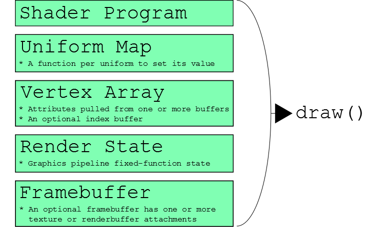

<!-- More links to specific parts of the reference documentation and Sandbox -->

Cesium is a client-side library written in JavaScript.  The Cesium stack is coarsely organized and composed of four layers:


Generally, each layer adds functionality, raises the level of abstraction, and depends on the layers underneath it.  The layers are:
* _Core_ - number crunching like linear algebra, intersection tests, and interpolation.
* _Renderer_ - a thin abstraction over [WebGL](http://www.khronos.org/webgl/).
* _Scene_ - globe and map constructs like imagery layers, polylines, labels, and cameras.
* _Dynamic Scene_ - Time-dynamic visualization constructs including [CZML](https://github.com/AnalyticalGraphicsInc/cesium/wiki/Cesium-Language-%28CZML%29-Guide) rendering.

Each layer corresponds to one directory in the [source tree](https://github.com/AnalyticalGraphicsInc/cesium/tree/master/Source).  All layers are available to applications built using Cesium.  All apps use Core.  As shown below, a small subset of apps use Renderer directly, many apps use Scene directly, and perhaps the most apps, such the Cesium Viewer, use Dynamic Scene.


The following sections provide an overview of each layer.  For details on specific types, see the [reference documentation](http://cesium.agi.com/Documentation/).  For editable example code, see the [Sandbox](http://cesium.agi.com/Sandbox/Examples/Sandbox/).

## Core


Core is the lowest layer in Cesium, and contains low-level, widely-used functions mostly related to math.  Examples include:
* Matrices, vectors, and quaternions.
* Transformations, such as cartographic to Cartesian.
* Map projections, such as Mercator and Equidistant Cylindrical.
* Sun position.
* Julian dates.
* Splines for interpolating position and orientation.
* Geometric routines like triangulation, subdivision surfaces, vertex cache optimization, and computing ellipse boundaries.

For example, the following code converts a cartographic point on the WGS84 ellipsoid at (0.0, 0.0), in radians, to Cartesian, that is, it converts from longitude/latitude to xyz:
```javascript
var ellipsoid = Ellipsoid.getWgs84();
var p = ellipsoid.toCartesian(new Cartographic2(0.0, 0.0));
```
The example below computes boundary points for an ellipse defined by a center point, two radii, and a bearing angle, on the WGS84 ellipsoid.
```javascript
var ellipsoid = Ellipsoid.getWgs84();
var center = ellipsoid.toCartesian(new Cartographic2(0.0, 0.0));
var bearing = CesiumMath.toRadians(60.0); // Cesium uses radians everywhere.
var positions = Shapes.computeEllipseBoundary(ellipsoid, center, 500000.0, 300000.0, bearing);
```

## Renderer


Renderer is a thin abstraction over WebGL that provides most of the flexibility of directly using WebGL but requires much less code.  Renderer includes built-in GLSL uniforms and functions, and abstractions for shader programs; textures and cube maps; buffers and vertex arrays; render states; and framebuffers.

Most apps will not use Renderer directly; instead, they will use higher-level constructs in Scene or Dynamic Scene that are closer to their problem domain.  However, Renderer is fully exposed to apps, allowing them to include custom rendering code.

GLSL code has access to a ton of Cesium built-in uniforms and functions, for example:
```javascript
gl_Position = agi_modelViewProjection * position;
v_positionWC = (agi_model * position).xyz;
v_positionEC = (agi_modelView * position).xyz;
v_normalEC = agi_normal * normal;
// ...
agi_ray ray = agi_ray(vec3(0.0), normalize(v_positionEC));
agi_raySegment interval = agi_rayEllipsoidIntersectionInterval(ray, ellipsoid);
```
See the GLSL section in the [reference documentation](http://cesium.agi.com/Documentation/).

Given vertex and fragment shader source strings, shader programs can be created in a single line of code:
```javascript
var sp = context.getShaderCache().getShaderProgram(vs, fs);
```
Textures and cube maps have abstractions so we never have to worry about binding a texture.  Uniforms are also abstracted; mistakes like calling `getUniformLocation` on uniforms that were optimized out are not possible.
```javascript
this.bumpTexture = context.createTexture2D({ 
  source      : bumpImage,
  pixelFormat : PixelFormat.LUMINANCE 
});
// ...
var that = this;
var uniforms = {
  u_bumpMap :  function() { return  that.bumpTexture; },
  u_nightIntensity :  function() { return 0.8; }
};
```
Vertex arrays simplify organizing vertex attributes.
```javascript
var mesh = BoxTessellator.compute({             // BoxTessellator is in Core
  dimensions :  new Cartesian3(1.0, 2.0, 3.0)
}));
var va = context.createVertexArrayFromMesh({
  mesh : mesh,
  bufferUsage : BufferUsage.STATIC_DRAW,
  vertexLayout : VertexLayout.INTERLEAVED
});
```
Render states define the fixed-function state of the graphics pipeline for a draw call.  We never worry about global state.



```javascript
var rs = context.createRenderState({
  depthTest : {
    enabled : true
  },
  cull : {
    enabled : true,
    face    : CullFace.BACK  
  },
  blending : BlendingState.ALPHA_BLEND
}); 

context.draw({
  primitiveType : PrimitiveType.TRIANGLES,
  shaderProgram : sp,
  uniformMap : uniforms,
  vertexArray : va,
  renderState : rs
});
```

## Scene


Scene builds on Core and Renderer to provide relativity high-level map and globe constructs, including:
* 3D globe, 2D map, and 2.5D columbus view all with one API.
* Streaming high-resolution imagery, including Bing Maps, Esri, OpenStreetMap, and WMS.
* Polylines, polygons, billboards, labels, and sensors.
* Materials that describe appearance.
* Cameras that control the view and respond to input.
* Animations that change properties over time.

<p align="center">

</p>

Scene represents all the graphical objects and state for canvas; there is a one-to-one relationship between a scene and a canvas:
```javascript
var scene = new Scene(document.getElementById("canvas"));
```
A scene can be 3D, 2D, or columbus view.  A scene can morph between these views with one line of code.

Primitives are objects in the scene that are drawn.  Their implementation uses Renderer to make WebGL calls.  `Scene.render` has three major steps:
* Animate: An app-specific animation function moves primitives and changes their properties.
* Update: Primitives sync their state with Renderer resources such as vertex buffer and textures.
* Render: Issue draw calls for each primitive.

```javascript
scene.setAnimation(function() {
  scene.setSunPosition(SunPosition.compute().position);
});

(function tick() {
  scene.render();
  requestAnimationFrame(tick);
}());
```
The `CentralBody` primitive represents the globe (in a future Cesium version, any central body such as the Moon and Mars will be supported).  High-resolution imagery from various servers is added using tile providers.
```javascript
cb.dayTileProvider = new Cesium.OpenStreetMapTileProvider({
    url : 'http://otile1.mqcdn.com/tiles/1.0.0/osm/',
    proxy : new Cesium.DefaultProxy('/proxy/')
});
```
Materials represent the appearance of an object.  Currently, they can be applied to polygons and sensors.  Loosely speaking, materials are implemented as a GLSL shader function and a set of uniforms.
```javascript
polygon.material = new Cesium.VerticalStripeMaterial({
    repeat: 5.0
});
```
Camera represents the view into the virtual world.  Ultimately, it creates a view matrix that transforms from world to eye coordinates.  Camera can be manipulated directly, but is most often updated automatically via controllers for specific tasks such as handling mouse input for spinning the globe, or smoothly flying to another location.
```javascript
scene.getCamera().getControllers().addFlight({
    destination: ellipsoid.cartographicDegreesToCartesian(new Cesium.Cartographic3(-118.26, 34.19, 100000.0)),
    duration: 4.0
});
```

## Dynamic Scene


TBA