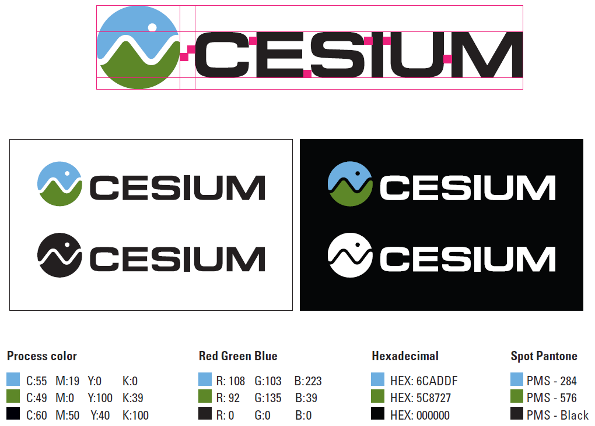

Right click and save an image, or download the <a href="logos/Cesium_Logo_Color.SVG">svg</a> version.

<pre>Color with white background:

Color with alpha, for light backgrounds:

Color with alpha, for dark backgrounds:

Black on white:

Color with white text on black: 

White on black:
</pre>

Style guide ([pdf](logos/Cesium_Logo_StyleGuide.pdf)):

Logo design by Fran Kelly and Jason Martin, [Analytical Graphics, Inc](http://www.agi.com/).
