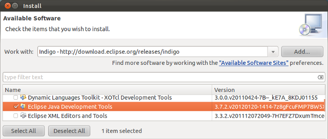
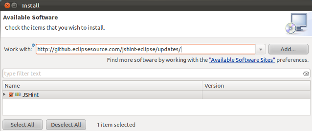
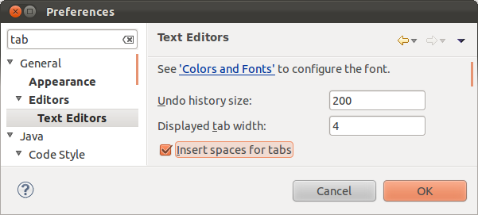
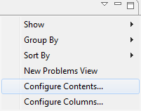
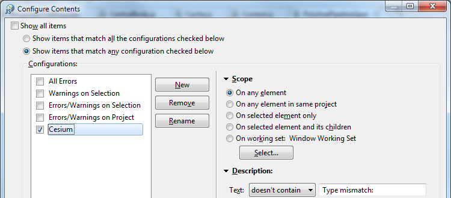
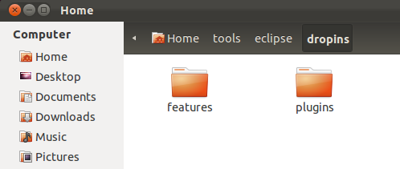
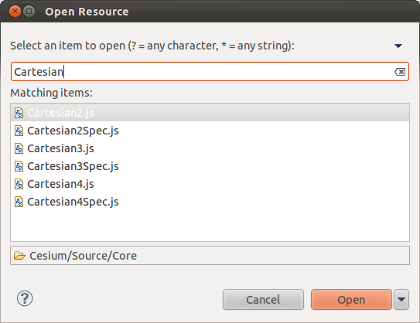
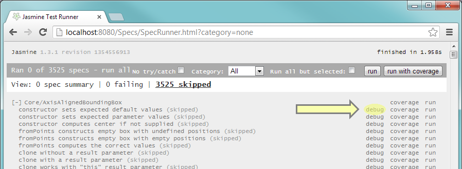
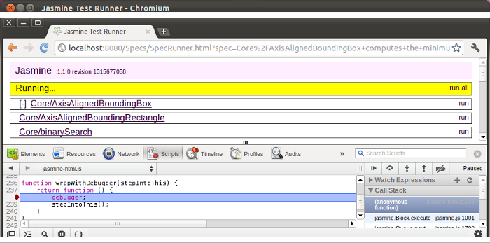

We are a community that encourages contributions.  Join us.  Here's how.

* [Get Started](#getstarted)
   * [Get the Code](#getthecode)
   * [Build the Code](#buildthecode)
   * [Set up Eclipse](#setupeclipse)
   * [Next Steps](#nextsteps)
* [Become an Expert](#becomeanexpert)
   * [Build Targets](#buildtargets)
   * [Optional Eclipse Configuration](#optionaleclipseconfiguration)
   * [Eclipse Tips](#eclipsetips)
   * [Test Tips](#testtips)
   * [Graphics Tips](#graphicstips)
* [Contribute Code](#contributecode)

<a name="getstarted">
# Get Started

<a name="getthecode">
## Get the Code

Short version:
* No commit access? Fork and clone [cesium](https://github.com/AnalyticalGraphicsInc/cesium).
* Commit access? Clone [cesium](https://github.com/AnalyticalGraphicsInc/cesium) and make all changes in a branch.

Details
* Setup Git if it isn't already ([linux](https://help.github.com/articles/set-up-git#platform-linux) | [mac](https://help.github.com/articles/set-up-git#platform-mac) | [windows](https://help.github.com/articles/set-up-git#platform-windows)).
   * Check your settings for name and email: `git config --get-regexp user.*`.
   * Recommended Git settings:
      * `git config --global push.default upstream` - when running `git push`, only push the current branch.
      * `git config --global branch.autosetuprebase always` - when pulling remote changes, rebase your local changes on top of the remote changes, to avoid unnecessary merge commits.
* Have commit access to cesium?
   * No
      * Fork [cesium](https://github.com/AnalyticalGraphicsInc/cesium).
      * Create a local repo of your fork, e.g., `git clone git@github.com:yourusername/cesium.git`.
   * Yes
      * Create a local cesium repo, e.g., `git clone git@github.com:AnalyticalGraphicsInc/cesium.git`.
      * Make non-trivial changes in a branch, e.g., `git checkout -b myFeature`.

<a name="buildthecode">
## Build the Code

From the root Cesium directory, run:
<pre>
./Tools/apache-ant-1.8.2/bin/ant combine runServer
</pre>
Then browse to [http://localhost:8080/](http://localhost:8080/).

Details
* Cesium uses [Ant](http://ant.apache.org/) for builds.  Ant is included in the Cesium repo, but it requires that the [Java](http://www.java.com/en/download/index.jsp) JDK be installed.
* [NodeJS](http://nodejs.org/) is also used by some targets.  The repository includes binaries, but on 64-bit Linux, you'll either need to have 32-bit libraries installed (in Ubuntu, run `sudo apt-get install ia32-libs`), or you can install NodeJS yourself and use a binary from your PATH by specifying `-DnodePath=node` when running Ant.

For a default developer build, run Ant from the root Cesium directory:

<pre>
./Tools/apache-ant-1.8.2/bin/ant
</pre>

To run the HTTP server for testing, run:

<pre>
./Tools/apache-ant-1.8.2/bin/ant runServer
</pre>

For all build options, see [Build Targets](#buildtargets) below.

<a name="setupeclipse">
## Set up Eclipse

We encourage contributors to use their IDE of choice, but many of us use Eclipse.  Here's how we set it up.

* Install the [Java JDK](http://www.oracle.com/technetwork/java/javase/downloads/index.html) if it isn't already.
* Download the [Eclipse IDE](http://www.eclipse.org/downloads/) for Java Developers.  Extract to a directory of your choice.  Run it.

* Install additional Eclipse components: JavaScript Development Tools and Eclipse Web Developer Tools.
   * Help - Install New Software.  Work with: select *Juno* from the list.
   * Expand *Programming Languages*, check *Eclipse JavaScript Development Tools*.
   * Expand *Web, XML, Java EE and OSGi Enterprise Development*, check *Eclipse Web Developer Tools*.
   * Next, Next, Accept, Finish, _wait_, Not Now (we have more to install).

* Install the [JSHint](http://www.jshint.com/) plugin: 
   * Help - Install New Software.  Work with: `http://github.eclipsesource.com/jshint-eclipse/updates/`.
   * Check *JSHint*.  Next, Next, Accept, Finish, _wait_, Restart.

* Run Eclipse. Close the Welcome page.

* Window - Preferences:
   * General - Editors - Text Editors.  Check Insert spaces for tabs.  OK.
   * Web - CSS Files - Editor.  Switch the radio button to "Indent using spaces".  Change Indentation size to 4.
   * Web - HTML Files - Editor.  Switch the radio button to "Indent using spaces".  Change Indentation size to 4.

* Import Cesium into your workspace:  File - Import, General - Existing Projects into Workspace, Next.  Fill in the path to the root Cesium directory, Finish.

* Click the "Open Perspective" button in the upper right and select JavaScript.  You can then right-click on the Java perspective and close it.

* Window - Show View - Console.

* Configure the problems tab.  The Eclipse JavaScript validator has some bugs that report incorrect warnings.  Click the down arrow on the right-hand side of the Problems tab, click Configure Contents.  Uncheck Show all items, Click New, then Rename the new item to Cesium.  Change the Text filter to "doesn't contain" "Type mismatch: ".  OK.

Also consider the [Optional Eclipse Configuration](#optionaleclipseconfiguration) options below.

<a name="nextsteps">
## Next Steps

At this point you are ready to contribute.  Continue reading below for more details on the developer setup, or read about Cesium's [architecture](Architecture); check out the [roadmap](Roadmap); join the [forum](http://cesium.agi.com/forum.html); and start hacking.

<a name="becomeanexpert">
# Become an Expert

This section has additional information on our development tools.

<a name="buildtargets">
## Build Targets

The following targets can be built:
   * `build` - A fast, developer-oriented build that prepares the source tree for use as standard [Asynchronous Module Definition (AMD)](https://github.com/amdjs/amdjs-api/wiki/AMD) modules, suitable for running tests and most examples (some Sandcastle examples require running `combine`).  This runs automatically when saving files in Eclipse.
   * `combine` - Runs `build`, plus uses [NodeJS](http://nodejs.org/) to run [the RequireJS optimizer](http://requirejs.org/docs/optimization.html) to combine Cesium and [the Almond AMD loader](http://requirejs.org/docs/faq-optimization.html#wrap) to produce all-in-one files in the `Build/Cesium` directory that expose the entire Cesium API attached to a single global Cesium object.  This version is useful if you don't want to use the modules directly with a standard AMD loader.
   * `minify` - Runs `combine`, plus [minifies](http://en.wikipedia.org/wiki/Minification_(programming\)) Cesium.js using [UglifyJS2](https://github.com/mishoo/UglifyJS2) for a smaller deployable file.  
   * `buildApps` - Cesium doesn't require any framework, but some example applications, such as Cesium Viewer, are [Dojo](http://dojotoolkit.org/) applications.  This build target runs the [Dojo build process](http://dojotoolkit.org/reference-guide/1.8/build/) to produce self-contained, minified, deployable versions of these applications in the `Build` directory.
   * `generateDocumentation` - Generates HTML documentation in `Build/Documentation` using [JSDoc 3](https://github.com/jsdoc3/jsdoc).
   * `release` - A full release build that creates a shippable product, including building apps and generating documentation.
   * `instrumentForCoverage` - Runs [JSCoverage](http://siliconforks.com/jscoverage/) on the source tree to allow running tests with coverage information.  Use the link in index.html.  Currently Windows only.
   * `jsHint` - Runs [JSHint](http://www.jshint.com/) on the entire source tree.  If you use Eclipse, see below for how to run JSHint automatically as you develop.
   * `runServer` - Launches a [Jetty](http://jetty.codehaus.org/jetty/)-based HTTP server on http://localhost:8080 for easy access to the tests, examples, and documentation.  This also provides proxying for tile server providers that don't yet support [CORS](http://en.wikipedia.org/wiki/Cross-origin_resource_sharing) for retrieving tiles, which is required for use as textures.  To change the port, pass `-DrunServer.port=X`, where `X` is the desired port.
   * `runPublicServer` - The same as `runServer` with the `-DrunServer.public=true` argument and allows for external connections.
   * `makeZipFile` - Builds a zip file containing all release files.  This includes the source tree (suitable for use from an AMD-aware application), plus the combined Cesium.js files, the generated documentation, the test suite, and the example applications (in both built and source form).
   * `clean` - Removes all generated build artifacts.

Specify the target(s) at the command line:

<pre>
./Tools/apache-ant-1.8.2/bin/ant [target-name] [another-target-name] ...
</pre>

For example, to build the release target and then start an HTTP server for testing, run:

<pre>
./Tools/apache-ant-1.8.2/bin/ant release runServer
</pre>

<a name="optionaleclipseconfiguration">
## Optional Eclipse Configuration

These steps are optional depending on your preference.

### Markdown Plugin

If you edit markdown files (.md) with Eclipse, installing the [Markdown plugin](http://www.winterwell.com/software/markdown-editor.php) is useful.

### GLSL Plugin

If you edit WebGL shader files (.glsl) with Eclipse, install GLShaders for GLSL syntax highlighting.  First exit Eclipse, then download [GLShaders](http://sourceforge.net/projects/glshaders/) and extract into Eclipse's dropins directory.

### Git Plugin

Most of us use Git from the command-line, but there is also an Eclipse plugin.  To install it:
   * Help - Install New Software.  Work with: select *Juno* from the list.  
   * Expand *Collaboration*, check *Eclipse EGit*.
   * Next, Next, Accept, Finish, _wait_, Restart.

* Window - Preferences: Team - Git - Configuration
   * Verify Location in User Settings tab is set to .gitconfig in the default repository directory.
   * Verify Location in Systems Settings tab is set to {Installed/Git/Location}/etc/gitconfig.

* Right click on Cesium in the Script Explorer.  Team - Share project.  Select Git, Next.  Check Use or create repository in parent directory of project.  Finish.

<a name="eclipsetips">
## Eclipse Tips

* Use Ctrl-Shift-R to search and open files in the workspace.

* Use Ctrl-Shift-F to auto format selected code or an entire file.

<a name="testtips">
## Test Tips

* To debug an individual test (spec), open the browser's debugger, e.g., Ctrl-Shift-I in Chrome, and click debug to the far right of the test.

Then, to step into the test, step into `stepIntoThis()`

<a name="graphicstips">
## Graphics Tips

* Keep your video card drivers up to date.  [NVIDIA](http://www.nvidia.com/Download/index.aspx) &bull; [AMD](http://support.amd.com/us/gpudownload/Pages/index.aspx).

* Use [www.webglreport.com](http://www.webglreport.com) to see if WebGL is supported, and if so, what is exactly supported.  For more goodness, including the ANGLE revision, browse to chrome://gpu-internals/ in Chrome.

* For WebGL debugging such as stepping through draw calls, viewing textures and vertex buffers, etc., use the [WebGL Inspector](http://benvanik.github.com/WebGL-Inspector/).

* To run without [ANGLE](http://code.google.com/p/angleproject/) (Windows-only)
   * Chrome:  Run with the --use-gl=desktop argument.  Make sure you close all Chrome windows before starting.
   * Firefox:  Browse to about:config and set webgl.prefer-native-gl to true.

* To debug shader problems when running with ANGLE enabled, it's sometimes useful to look at the generated HLSL code.  To do that, run Chrome with the `--enable-privileged-webgl-extensions` command-line option.  Then, obtain the HLSL code by executing: `var hlsl = gl.getExtension("WEBGL_debug_shaders").getTranslatedShaderSource(fragmentShader)`  

* For performance testing, turn off [vsync](http://hardforum.com/showthread.php?t=928593)
   * In the driver, e.g., the NVIDIA Control Panel or the Catalyst Control Center.
   * Also turn off VSync in Chrome: browse to chrome://flags/ and check Disable GPU VSync.

* For an FPS counter in Chrome, browse to chrome://flags/ and check FPS counter.  Create a FPS counter in Cesium with `PerformanceDisplay`

<a name="contributecode">
# Contribute Code

See [CONTRIBUTING.md](https://github.com/AnalyticalGraphicsInc/cesium/blob/master/CONTRIBUTING.md).