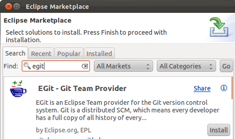

We are a community that encourages contributions.  Join us.  Check out our [roadmap](https://github.com/AnalyticalGraphicsInc/cesium/wiki/Roadmap); join the [development mailing list](https://groups.google.com/d/forum/cesium-dev); and start hacking.

## Getting the Code

* Setup git if it isn't already ([linux](http://help.github.com/linux-set-up-git/) | [mac](http://help.github.com/mac-set-up-git/) | [windows](http://help.github.com/win-set-up-git/)).
* Fork [cesium](https://github.com/AnalyticalGraphicsInc/cesium).
* Create a local repo of your fork, e.g., `git clone git@github.com:yourusername/cesium.git`.
* If you make changes you would like to contribute back, send us a [pull request](http://help.github.com/send-pull-requests/).

## Building the Code

TBA

## Setting up Eclipse

Although we encourage contributors to use their IDE of choice, many of us use Eclipse.  Here is how we set it up:

* Install [Java](http://www.java.com/en/download/index.jsp) if it isn't already.
* Download the [Eclipse IDE](http://www.eclipse.org/downloads/) for JavaScript Web Developers.  Extract to a directory of your choice.  Run it.
* Install the [JSHint](http://www.jshint.com/) plugin: Help - Install New Software, Work with: http://github.eclipsesource.com/jshint-eclipse/updates/.  Check JSHint.  Next, Next, Accept, Finish, _wait_, Not Now (we have more to install).

* Install the Java Development Tools (for Ant): Help - Install New Software, Work with: select Indigo from the list.  Expand Programming Languages, Check Eclipse Java Development Tools.  Next, Next, Accept, Finish, _wait_, Not Now.

* Install [EGit](http://www.eclipse.org/egit/) for git integration: Help - Eclipse Marketplace, Find: egit.  Install, Next, Accept, Finish, _wait_, Not Now.

* Install GLShaders for GLSL syntax highlighting:  Exit Eclipse.  Download [GLShaders](http://sourceforge.net/projects/glshaders/) and extract into eclipse's dropins directory.

* Run Eclipse. Close the Welcome page.

* Window - Show View - Console.

* Window - Preferences.  General - Editors - Text Editors.  Check Insert spaces for tabs.  OK.

* Import Cesium into your workspace:  File - Import, General - Existing Projects into Workspace, Next.  Fill in the path to the Cesium\Cesium directory, Finish.

* Right click on Cesium in the Script Explorer.  Team - Share project.  Select Git, Next.  Check Use or create repository in parent folder of project.  Finish.
