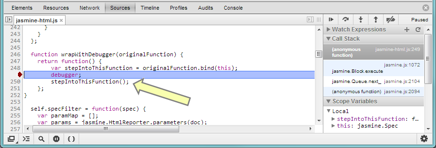

I took a pass on updating the Contributor's Guide to discuss both gulp and WebStorm.  I also have a lot of ideas for further improvements that I'll write up an issue for at some point (such as discussing how to add a test).  Here it is, since you can't do PRs on a wiki.

We are a community that encourages contributions.  Join us.  Here's how.

* [Get Started](#getstarted)
   * [Get the Code](#getthecode)
   * [Build the Code](#buildthecode)
   * [Set up Eclipse](#setupeclipse)
   * [Next Steps](#nextsteps)
* [Become an Expert](#becomeanexpert)
   * [Build Targets](#buildtargets)
   * [Optional Eclipse Configuration](#optionaleclipseconfiguration)
   * [Eclipse Tips](#eclipsetips)
   * [Test Tips](#testtips)
   * [Resources](#resources)
* [Contribute Code](#contributecode)

<a name="getstarted">
# Get started

<a name="getthecode">
## Get the code

* Setup Git if it isn't already ([link](https://help.github.com/articles/set-up-git/#platform-all)).
   * Make sure your SSH keys are configured ([linux](https://help.github.com/articles/generating-ssh-keys#platform-linux) | [mac](https://help.github.com/articles/generating-ssh-keys#platform-mac) | [windows](https://help.github.com/articles/generating-ssh-keys#platform-windows)).
   * Double-check your settings for name and email: `git config --get-regexp user.*`.
   * Recommended Git settings:
      * `git config --global push.default simple` - when running `git push`, only push the current branch (default in Git 2.0).
      * `git config --global pull.rebase preserve` - when pulling remote changes, rebase your local changes on top of the remote changes, to avoid unnecessary merge commits.
      * `git config --global fetch.prune true` - when fetching remote changes, remove any remote branches that no longer exist on the remote.
* Have commit access to cesium?
   * No
      * Fork [cesium](https://github.com/AnalyticalGraphicsInc/cesium).
      * Create a local repo of your fork, e.g., `git clone git@github.com:yourusername/cesium.git`.
      * We always recommend making changes in a branch, e.g., `git checkout -b myFeature`.
   * Yes
      * Create a local cesium repo, e.g., `git clone git@github.com:AnalyticalGraphicsInc/cesium.git`
      * Make changes in a branch, e.g., `git checkout -b myFeature`.

<a name="buildthecode">
## Build the code

Prerequisites:
 * Install [Node.js](http://nodejs.org/) on your system.

Cesium uses npm modules for development, so after syncing, you need to run `npm install` from the Cesium root directory:

```
npm install
```

Once all modules have been installed, run `npm run build` to actually build the code:

```
npm run build
```

Cesium ships with a simple HTTP server for testing, run `npm start` after building to use it:

```
npm start
```

Then browse to [http://localhost:8080/](http://localhost:8080/).

By default, the server only allows connections from your local machine.  Too allow connections from other machines, pass
the `--public` option to npm. Note the extra `--` is intentional and required by npm.

```
npm start -- --public
```

The development server has a few other options as well, which you can see by pasing the `--help` parameter:

```
npm start -- --help
```

While you can use the editor of your choice to develop Cesium, certain files, such as `glsl` and new tests, require that
the `build` task be executed in order for the changes to take affect.  You can use the `build-watch` script to have this
happen automatically.

<a name="buildtargets">
## Build scripts

Cesium uses [gulp](http://gulpjs.com/) for build tasks, but they are all abstracted away by [npm run scripts](https://docs.npmjs.com/cli/run-script).

Specify the target(s) at the command line:

```
npm run [target-name]
```

Here's the full set of scripts and what they do.
   * `build` - A fast, developer-oriented build that prepares the source tree for use as standard [Asynchronous Module Definition (AMD)](https://github.com/amdjs/amdjs-api/wiki/AMD) modules, suitable for running tests and most examples (some Sandcastle examples require running `combine`).  This runs automatically when saving files in Eclipse.
   * `build-watch` - A never-ending task that watches your file system for changes to Cesium and runs `build` on the source code as needed. 
   * `combine` - Runs `build`, plus the [the RequireJS optimizer](http://requirejs.org/docs/optimization.html) to combine Cesium and [the Almond AMD loader](http://requirejs.org/docs/faq-optimization.html#wrap) to produce all-in-one files in the `Build/Cesium` directory that expose the entire Cesium API attached to a single global Cesium object.  This version is useful if you don't want to use the modules directly with a standard AMD loader.
   * `minify` - Runs `combine`, plus [minifies](http://en.wikipedia.org/wiki/Minification_\(programming\)) Cesium.js using [UglifyJS2](https://github.com/mishoo/UglifyJS2) for a smaller deployable file.
   * `combineRelease` - Runs `combine`, plus uses the optimizer to remove debugging code that validates function input and throws DeveloperErrors.  The removed sections are marked with `//>>includeStart('debug', pragmas.debug);` blocks in the code.
   * `minifyRelease` - Runs `minify`, and removes debugging code.
   * `buildApps` - Builds the example applications (such as Cesium Viewer) to produce self-contained, minified, deployable versions in the `Build` directory.
   * `generateDocumentation` - Generates HTML documentation in `Build/Documentation` using [JSDoc 3](https://github.com/jsdoc3/jsdoc).
   * `release` - A full release build that creates a shippable product, including building apps and generating documentation.
   * `instrumentForCoverage` - Runs [JSCoverage](http://siliconforks.com/jscoverage/) on the source tree to allow running tests with coverage information.  Use the link in index.html.  Currently Windows only.
   * `jsHint` - Runs [JSHint](http://www.jshint.com/) on the entire source tree.
   * `jsHint-watch` - A never-ending task that watches your file system for changes to Cesium and runs [JSHint](http://www.jshint.com/) on any changed source files.  
   * `makeZipFile` - Builds a zip file containing all release files.  This includes the source tree (suitable for use from an AMD-aware application), plus the combined and minified Cesium.js files, the generated documentation, the test suite, and the example applications (in both built and source form).
   * `clean` - Removes all generated build artifacts.
   * `cloc` - Runs [CLOC](https://github.com/AlDanial/cloc) to count the lines of code on the Source and Specs directories.  This requires [Perl](http://www.perl.org/) to execute.
   * `sortRequires` - Alphabetically sorts the list of required modules in every `js` file.  It also makes sure that the top of every source file uses the same formatting.

<a name="nextsteps">
## Next Steps

At this point you are ready to contribute.  Continue reading below for more details on the developer setup, or read about Cesium's [architecture](Architecture); check out the [roadmap](Roadmap); join the [forum](http://cesiumjs.org/forum.html); and start hacking.

<a name="becomeanexpert">
# Become an Expert

This section has additional information on our development tools.

<a name="testtips">
## Test Tips

* To debug an individual test (spec), open the browser's debugger, e.g., Ctrl-Shift-I in Chrome, and click debug to the far right of the test.


Then, to step into the test, step into `stepIntoThis()`



<a name="resources">
## Resources

* [WebGL Profiling Tips](http://cesiumjs.org/2014/12/01/WebGL-Profiling-Tips/)
* [WebGL Debugging and Profiling Tools](http://www.realtimerendering.com/blog/)

<a name="contributecode">
# Contribute Code

See [CONTRIBUTING.md](https://github.com/AnalyticalGraphicsInc/cesium/blob/master/CONTRIBUTING.md).

<a name="setupide">
# Configure an IDE

We encourage contributors to use their IDE of choice, but many of us use WebStorm or Eclipse.  Here's how we set then up.

<a name="setupwebstorm">
## Set up WebStorm

* Install [WebStorm](https://www.jetbrains.com/webstorm/) if you don't already have it. While it's a commercial IDE,
it's pretty cheap and there's a 30-day free trial available.

The nice thing about WebStorm is that very little configuration is needed out of the box.  Just browse to and open
the WebStorm project included with Cesium.  Most things a Web Developer wants are built in, but whenever you open a file
that has a plugin available, such as `md`, `glsl`, or `.gitignore`, WebStorm will ask if you want to install it.
Simply say yes and off you go.  While most of us still use `git` on the command-line, WebStorm includes excellent tools
for merging, diffing, and managing branches as well.

### Gulp Integration

As we mentioned above, all of Cesium's build scripts use gulp.  WebStorm has excellent gulp integration to make running
tasks from the IDE simple.  Just right-click on `gulpfile.js` in the Project tree and select `Show Gulp Tasks`, now
you can simply double click on any task to run it.  Even better, perpetual tasks like `build-watch` and `jsHint-watch`
will get their own output tab that automatically updates.

### WebStorm Shortcuts

* Use Ctrl-Shift-A to search for settings, shortcuts, or anything else you want to do.
* Use Ctrl-Shift-N to search and open files in the workspace.
* Use Ctrl-ALT-L to auto-format an entire file or the selected block of code.
* Use Ctrl-Shift-F to bring up the global find dialog.

<a name="setupeclipse">
## Set up Eclipse

While primarily known as a Java IDE, Eclipse can be configured to work well for web development too.

* Install [Java](http://www.java.com/en/download/manual.jsp) if it isn't already.
* Download the [Eclipse IDE](http://www.eclipse.org/downloads/) for Java Developers.  Extract to a directory of your choice.  Run it.

* Install additional Eclipse components: JavaScript Development Tools and Eclipse Web Developer Tools.
   * Help - Install New Software.  Work with: select *Mars* from the list.
   * Expand *Programming Languages*, check *JavaScript Development Tools*.
   * Expand *Web, XML, Java EE and OSGi Enterprise Development*, check *Eclipse Web Developer Tools*.
   * Next, Next, Accept, Finish, _wait_, No (we have more to install).


* Install the [JSHint](http://www.jshint.com/) plugin: 
   * Help - Install New Software.  Work with: `http://github.eclipsesource.com/jshint-eclipse/updates/`.
   * Check *JSHint*.  Next, Next, Accept, Finish, _wait_, OK, _wait_, Restart.


* Run Eclipse. Close the Welcome page.

* Window - Preferences:
   * General - Editors - Text Editors.  Check Insert spaces for tabs.  Apply.
   * Web - CSS Files - Editor.  Switch the radio button to "Indent using spaces".  Change Indentation size to 4.  Apply.
   * Web - HTML Files - Editor.  Switch the radio button to "Indent using spaces".  Change Indentation size to 4.  OK.


* Import Cesium into your workspace:  File - Import, General - Existing Projects into Workspace, Next.  Fill in the path to the root Cesium directory, Finish.

* Click the "Open Perspective" button in the upper right and select JavaScript.  You can then right-click on the Java perspective and close it.

* Window - Show View - Console.

Also consider the [Optional Eclipse Configuration](#optionaleclipseconfiguration) options below.

<a name="optionaleclipseconfiguration">
## Optional Eclipse Configuration

These steps are optional depending on your preference.

### GLSL Plugin

If you edit WebGL shader files (.glsl) with Eclipse, install GLShaders for GLSL syntax highlighting.  First exit Eclipse, then download [GLShaders](http://sourceforge.net/projects/glshaders/) and extract into Eclipse's dropins directory.


### Git

Most of us use Git from the command-line, but there is also Eclipse integration:

* Window - Preferences: Team - Git - Configuration
   * Verify Location in User Settings tab is set to .gitconfig in the default repository directory.
   * Verify Location in Systems Settings tab is set to {Installed/Git/Location}/etc/gitconfig.

* Right click on Cesium in the Script Explorer.  Team - Share project.  Select Git, Next.  Check Use or create repository in parent directory of project.  Finish.

<a name="eclipsetips">
## Eclipse Tips

* Use Ctrl-Shift-R to search and open files in the workspace.


* Use Ctrl-Shift-F to auto format selected code.
