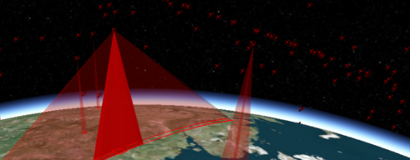

[Cesium](http://cesium.agi.com/) is an open-source JavaScript library for creating 3D globes and 2D maps in a web browser without a plugin. It uses HTML5 and [WebGL](http://www.khronos.org/webgl) for hardware-accelerated graphics.  Our code has shipped to [10's of millions of people in the same day](http://cesium.agi.com/noradtrackssanta2012.html).  We have a culture of writing clean, peer-reviewed, tested code.  Our developers are experts in their fields; they write books, create open standards, and present at international conferences.  We look forward to helping you grow your skills and ship beautiful code that has wide impact.

## Student Proposals

The student application period for SOCIS 2013 is from June 30 - August 4 (11am UTC).

View the complete [SOCIS program timeline](http://sophia.estec.esa.int/socis2013/?q=timeline) to review all of the program's deadlines.

**Technologies and Tools We Use**

(We don't expect you to know all of them).

HTML5, CSS3, JavaScript, WebGL, SVG, Git, Ant, Eclipse, Chrome, Firefox, Android

**Project Ideas**
* [Declutter for Map Labels](#decultterformaplabels)
* [Particle System](#particlesystem)
* [Ozone Widget Framework](#ozonewidgetframework)
* [Orbit Tuner Application](#orbittunerapplication)

<a name="decultterformaplabels">
## Declutter for Map Labels

 <small>Image from [Temporally Coherent Real-Time Labeling of Dynamic Scenes](http://wwwcg.in.tum.de/research/research/publications/2012/temporally-coherent-real-time-labeling-of-dynamic-scenes.html)</small>

A classic problem when drawing 2D or 3D maps is the overlap of nearby text labels, resulting in a cluttered display and illegible labels.  We will design and implement an efficient real-time algorithm to declutter map labels, avoiding or minimizing overlap.

This is an NP-hard problem, and therefore we will solve it heuristically in an attempt to minimize the amount we move each label and maintain temporal aesthetics.  We will also explore creating hierarchies of labels using [k-means](http://home.dei.polimi.it/matteucc/Clustering/tutorial_html/kmeans.html) and/or knowledge of hierarchical label relationships, e.g., street - city - county - state.

The algorithm needs to be very efficient; it must run in JavaScript and work for 100s of dynamic labels or 1000s of static labels.

References
* [Temporally Coherent Real-Time Labeling of Dynamic Scenes](http://wwwcg.in.tum.de/research/research/publications/2012/temporally-coherent-real-time-labeling-of-dynamic-scenes.html)
* [Dynamic Label Placement for Improved Interactive Exploration](http://maverick.inria.fr/Publications/2008/SD08/index.php)
* [K-Means Clustering](http://home.dei.polimi.it/matteucc/Clustering/tutorial_html/kmeans.html)

**Skills:** Algorithm design, strong math, code and algorithm optimization, JavaScript, git

**Level:** Advanced

**Mentor:** [Dan Bagnell](https://github.com/bagnell) - dbagnell@agi.com

**Backup Mentor:** [Patrick Cozzi](http://www.seas.upenn.edu/~pcozzi/) - pjcozzi@siggraph.

<a name="particlesystem">
## Particle System

 <small>Images from [Particle Systems - A Technique for Modeling a Class of Fuzzy Objects](https://www.lri.fr/~mbl/ENS/IG2/devoir2/files/docs/fuzzyParticles.pdf).</small>

Particles systems are used for visualizing "fuzzy objects" such as smoke, fire, explosion, sparks, clouds, dust, snow, rain, flowing water, etc. Initially, we are are interested in smoke trails.

This project will add support for modeling systems of particles to Cesium. View the [Particle System Details](https://github.com/AnalyticalGraphicsInc/cesium/wiki/Particle-System-Details) on the wiki for an implementation abstract and additional resource references.

**Skills:** Algorithm design, strong math and physics, code and algorithm optimization, WebGL, JavaScript, git

**Level:** Advanced

**Mentor:** [Dan Bagnell](https://github.com/bagnell) - dbagnell@agi.com

**Backup Mentor:** [Patrick Cozzi](http://www.seas.upenn.edu/~pcozzi/) - pjcozzi@siggraph.

<a name="ozonewidgetframework">
## Ozone Widget Framework

The [Ozone Widget Framework (OWF)](http://owfgoss.org/) is an open-source platform that allows users to build web applications using a wide variety of widgets that can communicate via a common API. This project would integrate a new Cesium widget with Ozone.

See the existing [mailing list discussion](https://groups.google.com/forum/#!searchin/cesium-dev/owf/cesium-dev/luSQFXKD5KM/cz8XAyFU9zEJ).

**Skills:** JavaScript, HTML5, git

**Level:** Intermediate

**Mentor:** [Matt Amato](https://twitter.com/matt_amato) - matt.amato@gmail.com

**Backup Mentor:** [Scott Hunter](https://github.com/shunter) - scott.k.hunter@gmail.com

<a name="orbittunerapplication">
## Orbit Tuner Application

In this project, we will create a Cesium application that allows users to manipulate the different parameters that define a satellite's orbit. Users will be able to change the values of different orbital elements, such as eccentricity and inclination, and immediately be able to observe their effects on a satellite's path.

**Skills:** JavaScript, HTML5, git

**Level:** Novice

**Mentor:** TBD

**Backup Mentor:** Richard Page - rpage@agi.com