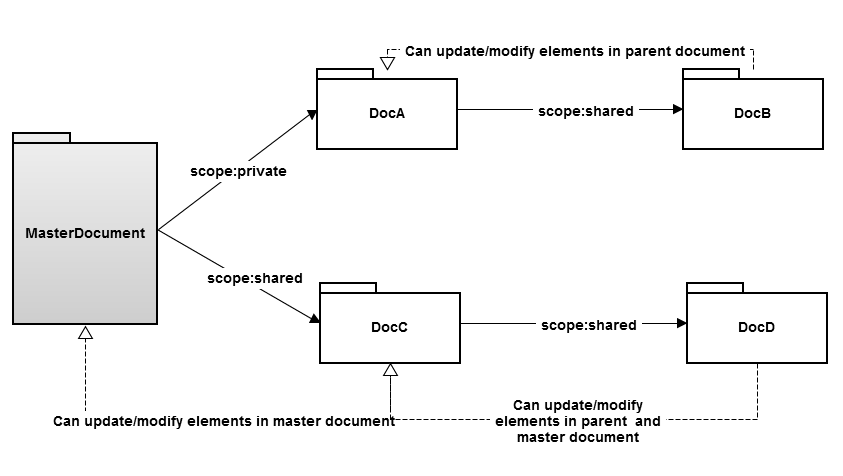

## Main goals
* Dynamic distribution of data.
* Share your czml file with multiple end users.
* End users can view your changes automatically.
* Expose web services that create dynamic czml. Link to the web service in your czml document.
* Layering capability.
* Embedded, file based, or web based.


## Details
A Cesium layer/object can reference an external Cesium source, either as a JSON document (`json` property), as an EventSource stream (`eventSource` property) or as traditional polling(`polling` property).

```javascript
[
  {
    "id":"MyExternalDocument",
    "external":{
      "json":[{
        "id":"MyObject",
        "position":{"cartographicDegrees":[-75.0, 40.0, 0.0]}
      }]
    }
  }
]
```

```javascript
[
  {
    "id": "MyExternalDocument",  
    "external": {  
      "eventSource": "http://www.agi.com/computeaccess?id={0}",  
      "parameters": [  
        "SelectedObjectID"  
      ],  
      "scope": "shared"  //optional, default is private.
    }  
  }
]
```

```javascript
[
  {  
    "id": "MyExternalDocument",  
    "external": {  
      "polling": "http://www.agi.com/computeaccess",  
      "refreshInterval": "20",  //seconds  
      "maxSessionLength": "2000", //seconds, optional, default is do not terminate
    }  
  }  
]
```
As shown above, external document URIs can have client-supplied parameters that make it easy to do things like compute access to the selected object or load data specific to the current view parameters. This parameter system could get very complicated, but we'll probably just support some important and simple use-cases in the first versions.


A Cesium client can have multiple Cesium scopes, each of which can have multiple Cesium sources. Cesium scopes are completely isolated from each other. A property on an object in one scope cannot reference a property on an object in another scope using "#id" or {$ref} syntax.
By default, the scope of an external document is "private", meaning that objects loaded from the external document are placed underneath the external document object in the hierarchy. In addition, they're placed in their own scope so that two objects with the same ID, one in the main document and one in the external document, will be treated as distinct objects. By setting it to "shared", the external document is allowed to modify properties of objects in the main document and new objects are not placed underneath the external document object in the hierarchy unless their parent property explicitly says so.


## Example
The figure below illustrates Cesium scopes.



MasterDocument
```javascript
[
  {
    "id":"DocA",
    "external":{
      "json":[{
        "id":"firstElement", 
	"position":{"cartographicDegrees":[25.0,40.0,0.0]}
        //since this is in a private scope, it does not clash with the other object with id "firstElement"
      },
      {
        "id":"DocB",
        "external":{"polling":"http://...", "scope","shared"}
      }]
    }
  },
  {
    "id":"DocC",
    "external":{"polling":"http://...", "scope","shared"}
  },
  {
    "id":"firstElement",
    "position":{"cartographicDegrees":[40.0,40.0,0.0]}
  }
]
```

DocB
```javascript
[
  {
     "id":"firstElement",
     "position":{"cartographicDegrees":[-75.0,40.0,0.0]}
     //modifies firstElement DocA but does not modify MasterDocument.
  }
]
```

DocC
```javascript
[
  {
    "id":"DocD",
    "external":{"eventSource":"http://...", "scope":"shared"}
  },
  {
    "id":"firstElement",
    "position":{"cartographicDegrees":[-75.0,40.0,0.0]}
    //modifies firstElement in MasterDocument
  }
]
```

DocD
```javascript
[
  {
    "id":"firstElement",
    "position":{"cartographicDegrees":[40.0,40.0,0.0]}
    //modifies firstElement DocC which modifies MasterDocument.
  }
]
```