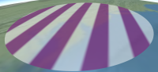

Fabric is a JSON schema for describing materials in Cesium.  Materials represent the appearance of an object such as polygons and sensors.

Materials can be as simple as draping an image over an object, or applying a pattern such as stripes or a checkerboard.  Materials can be more complex such as procedural wood or view-dependent reflection and refraction.  Materials can be combined in a hierarchy to create new materials; for example, wet crumbling bricks can be created with a combination of procedural brick, bump map, and specular map materials.



<br />


Materials are applied to objects by assigning to the object's `material` property.
````
polygon.material = new Cesium.Material({
  context : scene.getContext(),
  fabric : {
    'id' : 'ColorMaterial'
  }
});
````
Above, the `id` in the Fabric JSON refers to a built-in material, `ColorMaterial`, which represents a single color, including alpha.

Each material has zero or more uniforms, which are input parameters that can be specified when creating the material and modified after.  For example, `ColorMaterial` has a `color` uniform with `red`, `green`, `blue`, and `alpha` components.
````
polygon.material = new Cesium.Material({
  context : scene.getContext(),
  fabric : {
    'id' : 'ColorMaterial',
    'uniforms' : {
      'color' : {
        'red' : 1.0,
        'green' : 0.0,
        'blue' : 0.0,
        'alpha' : 0.5
      }
    }
  }
});

// Change from translucent red to opaque white
polygon.material.uniforms.color = Cesium.Color.WHITE;
````

## Built-In Materials

_TODO: screen shots and links to Sandcastle_

Cesium has several built-in materials like `ColorMaterial`.

* Procedural textures - checkerboard, stripes, dots, brick, cement, asphalt, wood, grass, distance intervals, tie-dye, facet, blob.
   * These patterns are procedural computed on the GPU and do not rely on external image files.

* Color - a single color, including alpha for translucency.
* Image - a combination of diffuse and alpha map (described below) for representing images with an alpha channel such as .png.

* Diffuse map - an image with vec3 components defining incoming light that scatters evenly in all directions.
* Specular map - an image with a scalar component defining the intensity of incoming light reflecting in a single direction.  This is used to make parts of the surface shiny, e.g., water vs. land.
* Alpha map - an image with a scalar component defining the opacity of the material.  This is used to make parts of the surface translucent or transparent, e.g., a fence.
* Normal map - an image with vec3 components defining the surface's normal in tangent coordinates.  Normal mapping is used to add surface detail without adding geometry.
* Bump map - an image with a scalar component defining heights.  Like normal mapping, bump mapping is used to add surface detail without adding geometry by perturbing the normal based on differences in adjacent image pixels.
* Emission map - an image with vec3 components defining light emitted by the material equally in all directions, e.g., lights in a long hallway.
* Reflection - cube map reflection for mirror-like surfaces that reflect light, e.g., paint on a car.
* Refraction - cube map refraction for translucent surfaces that refract light, e.g., glass.
* Fresnel - a view-dependent combination of reflection and refraction.  Similar to water, when the viewer is looking straight down, the material is refracts light; as the viewer looks more edge on, the material refracts less and reflects more.

All built-in materials can be used similar to how we used `ColorMaterial` above.  For example, the following code uses a specular map.
````
polygon.material = new Cesium.Material({
  context : scene.getContext(),
  fabric : {
    'id' : 'SpecularMapMaterial',
    'uniforms' : {
      'texture': 'specular.png'
    }
  }
});
````
By default, the specular component is taken from the `r` component.  However, `SpecularMapMaterial` like most materials, contains a `channel` (`channels` for materials requiring more than one channel) that defines what channel to pull from.
````
polygon.material.uniforms.channel = 'a';
````
This allows packing data for multiple materials into the same texture, e.g., storing diffuse components as rgb and specular components as a in the same texture.

_TODO: sRepeat and tRepeat_

## Combing Materials

Let's create a material that combines a diffuse map and specular map.  First the JSON material:
<pre>
var fabric = {
  'id' : 'DiffuseSpecularMap',
  'materials': {
    'diffuseMaterial' : {
      'id' : 'DiffuseMapMaterial'
    },
    'specularMaterial' : {
      'id' : 'SpecularMapMaterial'
    }
  },
  'components': {
      'diffuse': 'diffuseMaterial.diffuse',
      'specular': 'specularMaterial.specular',
  }
};
</pre>