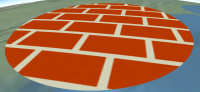
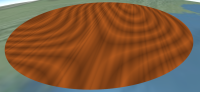

## Contents
* [**Introduction**](#Introduction)
* [**Built-In Materials**](#BuiltInMaterials)
   * [Procedural Textures](#ProceduralTextures)
   * [Base Materials](#BaseMaterials)

<a id="Introduction"></a>
## Introduction

_Fabric_ is a JSON schema for describing _materials_ in Cesium.  Materials represent the appearance of an object such as polygons and sensors.

Materials can be as simple as draping an image over an object, or applying a pattern such as stripes or a checkerboard.  More complex materials include procedural wood and view-dependent reflection and refraction.  New materials can be scripted using Fabric and GLSL, or created by combing existing materials in a hierarchy to create new materials; for example, wet crumbling bricks can be created with a combination of procedural brick, bump map, and specular map materials.


<br />




Objects that support materials have `material` property.  Currently, these objects are polygons and sensors.  Materials are applied by assigning to the object's `material` property.
```javascript
polygon.material = Material.fromID(scene.getContext(), 'Color');
```
Above, `Color` is a built-in material which represents a single color, including alpha.  `Material.fromID` is shorthand; the entire Fabric JSON can also be provided.
```javascript
polygon.material = new Cesium.Material({
  context : scene.getContext(),
  fabric : {
    "id" : "Color"
  }
});
```
Each material has zero or more uniforms, which are input parameters that can be specified when creating the material and modified after.  For example, `Color` has a `color` uniform with `red`, `green`, `blue`, and `alpha` components.
```javascript
polygon.material = new Cesium.Material({
  context : scene.getContext(),
  fabric : {
    "id" : "Color",
    "uniforms" : {
      "color" : {
        "red" : 1.0,
        "green" : 0.0,
        "blue" : 0.0,
        "alpha" : 0.5
      }
    }
  }
});

// Change from translucent red to opaque white
polygon.material.uniforms.color = Cesium.Color.WHITE;
```

<a id="BuiltInMaterials"></a>
## Built-In Materials

_TODO: links to Sandcastle_
_TODO: links to reference doc_

Cesium has several built-in materials.  Two widely used ones are:

| Name | Screenshot | Description |
|:-----|:-----------|:------------|
| `Color` |  | A single color, including alpha for translucency. |
| `Image` |  | Represents images with or without an alpha channel such as .png or .jpg.  A combination of diffuse, `rgb`, and alpha, `a`, components. |

All built-in materials can be used similar to how we used `Color`.  For example, the following code uses `Image`.
```javascript
polygon.material = Material.fromID(scene.getContext(), 'Image');
polygon.material.uniforms.texture = "image.png";
```
or
```javascript
polygon.material = new Cesium.Material({
  context : scene.getContext(),
  fabric : {
    "id" : "Image",
    "uniforms" : {
      "texture" : "image.png"
    }
  }
});
```

<a id="ProceduralTextures"></a>
### Procedural Textures

Procedural texture materials procedurally compute patterns on the GPU and do not rely on external image files.  They represent both diffuse and alpha components.

| Name | Screenshot | Description |
|:-----|:-----------|:------------|
| `Checkerboard` |  | Checkerboard with alternating light and dark colors. |
| `Stripe` |  | Alternating light and dark horizontal or vertical stripes |
| `Dots` |  | A pattern of dots organized by row and column. |
| `Brick` |  | Brick generated with a combination of a simple brick pattern and simplex noise for roughness. |
| `Cement` |  | Cement generated with simplex noise. |
| `Asphalt` |  | Asphalt generated with a combination of simplex and cellular noise. |
| `Wood` |  | Wood generated with simplex noise. |
| `Grass` |  | Grass generated with simplex noise. |
| `DistanceInterval` |  | Distances with colors. |
| `TieDye` |  | Procedural tie-dye generated with simplex noise. |
| `Facet` |  | Cacet generated with cellular noise. |
| `Blob` |  | Blob generated with cellular noise.  Resembles water, but clumped in a cell pattern. |

<a id="BaseMaterials"></a>
### Base Materials
 
| Name | Screenshot | Description |
|:-----|:-----------|:------------|
| `DiffuseMap` |  | An image with `vec3` components defining incoming light that scatters evenly in all directions. |
| `SpecularMap` |  | An image with a scalar component defining the intensity of incoming light reflecting in a single direction.  This is used to make parts of the surface shiny, e.g., water vs. land. |
| `AlphaMap` |  | An image with a scalar component defining the opacity of the material.  This is used to make parts of the surface translucent or transparent, e.g., a fence. |
| `NormalMap` |  | An image with `vec3` components defining the surface's normal in tangent coordinates.  Normal mapping is used to add surface detail without adding geometry. |
| `BumpMap` |  | An image with a scalar component defining heights.  Like normal mapping, bump mapping is used to add surface detail without adding geometry by perturbing the normal based on differences in adjacent image pixels. |
| `EmissionMap` |  | An image with `vec3` components defining light emitted by the material equally in all directions, e.g., lights in a long hallway. |
| `Reflection` |  | Cube map reflection for mirror-like surfaces that reflect light, e.g., paint on a car. |
| `Refraction` |  | Cube map refraction for translucent surfaces that refract light, e.g., glass. |
| `Fresnel` |  | A view-dependent combination of reflection and refraction.  Similar to water, when the viewer is looking straight down, the material is refracts light; as the viewer looks more edge on, the material refracts less and reflects more. |

_TODO: more general below_

By default, the specular component is taken from the `r` component.  However, `SpecularMap` like most materials, contains a `channel` uniform (`channels` for materials requiring more than one channel) that defines what channel to pull from.
```javascript
polygon.material = new Cesium.Material({
  context : scene.getContext(),
  fabric : {
    "id" : "SpecularMap",
    "uniforms" : {
      "texture" : "specular.png",
      "channel" : "a"
    }
  }
});
```
This allows packing data for multiple materials into the same texture, e.g., storing diffuse components as rgb and specular components as a in the same texture.

_TODO: sRepeat and tRepeat_

## Combing Materials

_TODO: start with creating materials from starch.

Let's create a material that combines a diffuse map and specular map.  First the JSON material:
```javascript
var fabric = {
  "id" : "DiffuseSpecularMap",
  "materials": {
    "diffuseMaterial" : {
      "id" : "DiffuseMap"
    },
    "specularMaterial" : {
      "id" : "SpecularMap"
    }
  },
  "components" : {
      "diffuse" : "diffuseMaterial.diffuse",
      "specular" : "specularMaterial.specular",
  }
};
```

A new `id` is used to name the material, `DiffuseSpecularMap`.  Since this material does not exist, a `components` section describes the output of the material.  This material has `diffuse` and `specular` components that pull values from materials reference in the `material` property.  The built-in `DiffuseMap` and `SpecularMap` materials are used.

Given this `fabric` object, the material can be used like other materials.
```javascript
var m = new Cesium.Material({
  context : scene.getContext(),
  fabric : fabric
});
polygon.material = m;

m.materials.diffuseMaterial.texture = 'diffuseMap.png';
m.materials.specularMaterial.texture = 'specularMap.png';
```

### Components

The `components` property contains the following optional sub-properties.  All are strings with a GLSL code snippet.

| Name | Default | Description |
|:-----|:--------|:------------|
| `diffuse` | `"vec3(0.0)"` | The diffuse component of this material.  The diffuse component is a vec3 defining incoming light that scatters evenly in all directions. |
| `specular` | `"0.0"` | The specular component of this material.  The specular component is a float defining the intensity of incoming light reflecting in a single direction. |
| `normal` |  | The normal component of this material.  The normal component is a vec3 defining the surface's normal in tangent coordinates.  It is used for effects such as normal mapping.  The default is the surface's unmodified normal. |
| `emission` | `"vec3(0.0)"` | The emission component of this material.  The emission component is a vec3 defining light emitted by the material equally in all directions.  The default is vec3(0.0), which emits no light. |
| `alpha` | `1.0` | The alpha component of this material.  The alpha component is a float defining the opacity of this material.  0.0 is completely transparent; 1.0 is completely opaque. |

Together, these sub-properties, or _components_ define the characteristics of the material.  They are the output of the material, and the input to the lighting system.

A material can simply pass through the components of other materials, e.g., `"diffuse" : "anotherMaterial.diffuse"`, or they can include GLSL code, e.g., "diffuse" : "mix(cold.diffuse, hot.diffuse, texture2D(temperature, materialInput.st).r)".