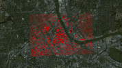

<!--
TODO: Animation changes values over time.
TODO: Links to full-size images.
TODO: Reference links?
-->

Cesium is a JavaScript virtual globe and map library written in JavaScript using [WebGL](http://www.khronos.org/webgl/).  It provides hardware-accelerated graphics in a browser without a plugin.

Cesium is built with care; code is peer-reviewed, unit tested, [statically analysed](http://www.jshint.com/), and [documented](http://cesium.agi.com/Documentation/).

## One API - Three Views

Cesium supports a 3D globe, 2D map, and Columbus view (2.5D) with the same API.  Transition between views with one line of code.

## Dynamic Geospatial Data Visualization

 

* Draw dynamic scenes from [CZML](https://github.com/AnalyticalGraphicsInc/cesium/wiki/czml-guide).
* Layer imagery from multiple sources, including WMS, OpenStreetMaps, Bing Maps, ArcGIS MapServer, and standard image files.  Each layer can be alpha blended with the layers below it.
* Draw vector data from KML (partial support), ESRI Shapefiles, and WebGL Globe JSON.
* Draw polylines, polygons, polygons with holes, circles, ellipses, extents, billboards, labels, ellipsoids, and sensors.
* Batching, culling, and JavaScript and GPU optimizations for performance.
* Precision handling for large view distances (avoiding [z-fighting](http://www.sjbaker.org/steve/omniv/love_your_z_buffer.html)) and large world coordinates (avoiding [jitter](http://blog.virtualglobebook.com/2010/11/vertex-transform-precision.html), partial support).
* Individual object picking.

<!-- For example, minimize GC pressure -->

## Apps and Widgets

* [Cesium Viewer](http://cesium.agi.com/CesiumViewer/) app for visualizing CZML files.
* [Sandbox](http://cesium.agi.com/Sandbox/Examples/Sandbox/) app for live coding.
* Timeline widget for scrubbing through time.
* Cesium and timeline widget for use with Dojo.

Checkout all the [demos](http://cesium.agi.com/).

## Cameras

Cameras respond to input and control the view.

* Spindle - spin, zoom, and pan the globe with inertia.
* Flight - flies to a destination.
* Free look - look in any direction.

## Materials

 

Materials describe the surface appearance of objects in the scene.

* Procedural textures - checkerboard, stripes, dots, brick, cement, asphalt, wood, grass, distance intervals, tie dye, ...
* Classic: diffuse map, specular map, alpha map, normal map, bump map, emission map, reflection, refraction, and Fresnel.
* [[Fabric]] - a JSON schema for describing and combing materials.

## Low-Level Rendering

For those needing custom drawing, Cesium contains a thin abstraction over WebGL that provides:

* Built-in GLSL uniforms for common transformations.
* Built-in GLSL functions for ellipsoids, rays, noise, lighting, Constructive Solid Geometry (experimental), ...
* Shader programs and caching.
* Textures and cube maps.
* Dynamic texture atlas packing.
* Buffers, vertex arrays, and vertex layout. 
* Render states.
* Framebuffers and renderbuffers.

## Geometric Routines

* View frustum and occlusion culling (horizon culling).
* Vertex cache optimization.
* Polygon triangulation and subdivision.
* Tessellation of ellipsoids, extents, boxes, and planes.
* Bounding spheres and axis-aligned bounding boxes.

## Math

* Types for Cartesian, spherical, and cartographic positions.
* Types for matrices and quaternions.
* Catmull-Rom splines.
* Lagrange, Hermite, spherical linear, and linear interpolation.
* Sun position.
* Equidistant Cylindrical and Mercator 2D map projections.
* Computations on ellipsoids such as computing computing surface normals, circles, ellipses, and tangent planes.
* Transformations such as cartographic to Cartesian, east-north-up to fixed frame, and TEME to pseudo-fixed frame.

## Time 

* Julian dates, leap seconds, time intervals, and UTC and TAI time standards.

## Infrastructure

* JSONP.
* Generic event handling.

## Deployment
* Use a Cesium as a single js file or with Asynchronous Module Definition (AMD) to include only what you use.

## Next Steps

Use the [Quick Start](https://github.com/AnalyticalGraphicsInc/cesium/wiki/Quick-Start) to get up and running with Cesium, or read the [Architecture Overview](https://github.com/AnalyticalGraphicsInc/cesium/wiki/Architecture) to learn about the code.

More questions?  See the [FAQ](https://github.com/AnalyticalGraphicsInc/cesium/wiki/FAQ).