This is a draft for a three-part blog series.  The first two are Cesium tutorials.  The last is a general graphics tech article.

# Part I: Geometry and Appearances

Cesium has a library of primitives, such as polygons and ellipsoids, that are the visual building blocks of our scene.  To use them, we create a primitive with position data and perhaps a [`material`](https://github.com/AnalyticalGraphicsInc/cesium/wiki/Fabric).  For example, copy and paste the following into the [Hello World Sandcastle Example](http://cesium.agi.com/Cesium/Apps/Sandcastle/index.html?src=Hello%20World.html) to create an extent on the globe with a dot pattern:

```javascript
var widget = new Cesium.CesiumWidget('cesiumContainer');
var scene = widget.scene;

scene.getPrimitives().add(new Cesium.ExtentPrimitive({
    extent : Cesium.Extent.fromDegrees(-100.0, 20.0, -90.0, 30.0),
    material : Cesium.Material.fromType('Dot')
}));
```
<p align="center"> [[geometryandappearances/extentPrimitive.png]] </p>

In this tutorial, we go under the hood of primitives and look at the [`Geometry`](http://cesium.agi.com/Cesium/Build/Documentation/Geometry.html) and [`Appearance`](http://cesium.agi.com/Cesium/Build/Documentation/Appearance.html) types that form them.  A geometry defines the primitive's structure, i.e., the triangles, lines, or points that compose the primitive.  An appearance defines the primitive's shading, including its full GLSL vertex and fragment shaders, and render state.

Cesium supports the following geometries.

<table>
<tr>
<td>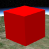</td>
<td><ul><li><b>BoxGeometry</b></li><li><a href="http://cesium.agi.com/Cesium/Build/Documentation/BoxGeometry.html">Reference documentation</a></li><li><a href="http://cesium.agi.com/Cesium/Apps/Sandcastle/index.html?src=Box.html">Code example</a></li></ul></td>
<td></td>
<td><ul><li><b>BoxOutlineGeometry</b></li><li><a href="http://cesium.agi.com/Cesium/Build/Documentation/BoxOutlineGeometry.html">Reference documentation</a></li><li><a href="http://cesium.agi.com/Cesium/Apps/Sandcastle/index.html?src=Box%20Outline.html">Code example</a></li></ul></td>
<td width="200">A box</td>
</tr>

<tr>
<td>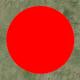</td>
<td><ul><li><b>CircleGeometry</b></li><li><a href="http://cesium.agi.com/Cesium/Build/Documentation/CircleGeometry.html">Reference documentation</a></li><li><a href="http://cesium.agi.com/Cesium/Apps/Sandcastle/index.html?src=Circle.html">Code example</a></li></ul></td>
<td>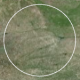</td>
<td><ul><li><b>CircleOutlineGeometry</b></li><li><a href="http://cesium.agi.com/Cesium/Build/Documentation/BoxOutlineGeometry.html">Reference documentation</a></li><li><a href="http://cesium.agi.com/Cesium/Apps/Sandcastle/index.html?src=Circle%20Outline.html">Code example</a></li></ul></td>
<td width="200">A circle or extruded circle</td>
</tr>

<tr>
<td>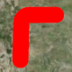</td>
<td><ul><li><b>CorridorGeometry</b></li><li><a href="http://cesium.agi.com/Cesium/Build/Documentation/CorridorGeometry.html">Reference documentation</a></li><li><a href="http://cesium.agi.com/Cesium/Apps/Sandcastle/index.html?src=Corridor.html">Code example</a></li></ul></td>
<td></td>
<td><ul><li><b>CorridorOutlineGeometry</b></li><li><a href="http://cesium.agi.cp,/Cesium/Build/Documentation/CorridorOutlineGeometry.html">Reference documentation</a></li><li><a href="http://cesium.agi.com/Cesium/Apps/Sandcastle/index.html?src=Corridor%20Outline.html">Code example</a></li></ul></td>
<td width="200">A polyline normal to the surface with a width in meters and optional extruded height</td>
</tr>

<tr>
<td>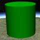</td>
<td><ul><li><b>CylinderGeometry</b></li><li><a href="http://cesium.agi.com/Cesium/Build/Documentation/CylinderGeometry.html">Reference documentation</a></li><li><a href="http://cesium.agi.com/Cesium/Apps/Sandcastle/index.html?src=Cylinder.html">Code example</a></li></ul></td>
<td>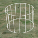</td>
<td><ul><li><b>CylinderOutlineGeometry</b></li><li><a href="http://cesium.agi.com/Cesium/Build/Documentation/CylinderOutlineGeometry.html">Reference documentation</a></li><li><a href="http://cesium.agi.com/Cesium/Apps/Sandcastle/index.html?src=Cylinder%20Outline.html">Code example</a></li></ul></td>
<td width="200">A cylinder, cone, or truncated cone</td>
</tr>

<tr>
<td>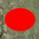</td>
<td><ul><li><b>EllipseGeometry</b></li><li><a href="http://cesium.agi.com/Cesium/Build/Documentation/EllipseGeometry.html">Reference documentation</a></li><li><a href="http://cesium.agi.com/Cesium/Apps/Sandcastle/index.html?src=Ellipse.html">Code example</a></li></ul></td>
<td>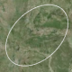</td>
<td><ul><li><b>EllipseOutlineGeometry</b></li><li><a href="http://cesium.agi.com/Cesium/Build/Documentation/EllipseOutlineGeometry.html">Reference documentation</a></li><li><a href="http://cesium.agi.com/Cesium/Apps/Sandcastle/index.html?src=Ellipse%20Outline.html">Code example</a></li></ul></td>
<td width="200">An ellipse or extruded ellipse</td>
</tr>

<tr>
<td>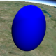</td>
<td><ul><li><b>EllipsoidGeometry</b></li><li><a href="http://cesium.agi.com/Cesium/Build/Documentation/EllipsoidGeometry.html">Reference documentation</a></li><li><a href="http://cesium.agi.com/Cesium/Apps/Sandcastle/index.html?src=Ellipsoid.html">Code example</a></li></ul></td>
<td></td>
<td><ul><li><b>EllipsoidOutlineGeometry</b></li><li><a href="http://cesium.agi.com/Cesium/Build/Documentation/EllipsoidOutlineGeometry.html">Reference documentation</a></li><li><a href="http://cesium.agi.com/Cesium/Apps/Sandcastle/index.html?src=Ellipsoid%20Outline.html">Code example</a></li></ul></td>
<td width="200">An ellipsoid</td>
</tr>

<tr>
<td>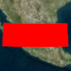</td>
<td><ul><li><b>ExtentGeometry</b></li><li><a href="http://cesium.agi.com/Cesium/Build/Documentation/ExtentGeometry.html">Reference documentation</a></li><li><a href="http://cesium.agi.com/Cesium/Apps/Sandcastle/index.html?src=Extent.html">Code example</a></li></ul></td>
<td>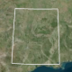</td>
<td><ul><li><b>ExtentOutlineGeometry</b></li><li><a href="http://cesium.agi.com/Cesium/Build/Documentation/ExtentOutlineGeometry.html">Reference documentation</a></li><li><a href="http://cesium.agi.com/Cesium/Apps/Sandcastle/index.html?src=Extent%20Outline.html">Code example</a></li></ul></td>
<td width="200">An rectangle or extruded rectangle</td>
</tr>

<tr>
<td></td>
<td><ul><li><b>PolygonGeometry</b></li><li><a href="http://cesium.agi.com/Cesium/Build/Documentation/PolygonGeometry.html">Reference documentation</a></li><li><a href="http://cesium.agi.com/Cesium/Apps/Sandcastle/index.html?src=Polygon.html">Code example</a></li></ul></td>
<td></td>
<td><ul><li><b>PolygonOutlineGeometry</b></li><li><a href="http://cesium.agi.com/Cesium/Build/Documentation/PolygonOutlineGeometry.html">Reference documentation</a></li><li><a href="http://cesium.agi.com/Cesium/Apps/Sandcastle/index.html?src=Polygon%20Outline.html">Code example</a></li></ul></td>
<td width="200">A polygon with optional holes or extruded polygon</td>
</tr>

<tr>
<td></td>
<td><ul><li><b>PolylineGeometry</b></li><li><a href="http://cesium.agi.com/Cesium/Build/Documentation/PolylineGeometry.html">Reference documentation</a></li><li><a href="http://cesium.agi.com/Cesium/Apps/Sandcastle/index.html?src=Polyline.html">Code example</a></li></ul></td>
<td></td>
<td><ul><li><b>SimplePolylineGeometry</b></li><li><a href="http://cesium.agi.com/Cesium/Build/Documentation/SimplePolylineGeometry.html">Reference documentation</a></li><li><a href="http://cesium.agi.com/Cesium/Apps/Sandcastle/index.html?src=Simple%20Polyline.html">Code example</a></li></ul></td>
<td width="200">A collection of line segments with a width in pixels</td>
</tr>

<tr>
<td></td>
<td><ul><li><b>PolylineVolumeGeometry</b></li><li><a href="http://cesium.agi.com/Cesium/Build/Documentation/PolylineVolumeGeometry.html">Reference documentation</a></li><li><a href="http://cesium.agi.com/Cesium/Apps/Sandcastle/index.html?src=Polyline%20Volume.html">Code example</a></li></ul></td>
<td></td>
<td><ul><li><code>PolylineVolumeOutlineGeometry</code></li><li><a href="http://cesium.agi.com/Cesium/Build/Documentation/PolylineVolumeOutlineGeometry.html">Reference documentation</a></li><li><a href="http://cesium.agi.com/Cesium/Apps/Sandcastle/index.html?src=Polyline%20Volume%20Outline.html">Code example</a></li></ul></td>
<td width="200">A 2D shape extruded along a polyline</td>
</tr>

<tr>
<td>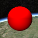</td>
<td><ul><li><b>SphereGeometry</b></li><li><a href="http://cesium.agi.com/Cesium/Build/Documentation/SphereGeometry.html">Reference documentation</a></li><li><a href="http://cesium.agi.com/Cesium/Apps/Sandcastle/index.html?src=Sphere.html">Code example</a></li></ul></td>
<td>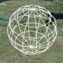</td>
<td><ul><li><b>SphereOutlineGeometry</b></li><li><a href="http://cesium.agi.com/Cesium/Build/Documentation/SphereOutlineGeometry.html">Reference documentation</a></li><li><a href="http://cesium.agi.com/Cesium/Apps/Sandcastle/index.html?src=Sphere%20Outline.html">Code example</a></li></ul></td>
<td width="200">A sphere</td>
</tr>

<tr>
<td>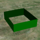</td>
<td><ul><li><b>WallGeometry</b></li><li><a href="http://cesium.agi.com/Cesium/Build/Documentation/WallGeometry.html">Reference documentation</a></li><li><a href="http://cesium.agi.com/Cesium/Apps/Sandcastle/index.html?src=Wall.html">Code example</a></li></ul></td>
<td></td>
<td><ul><li><b>WallOutlineGeometry</b></li><li><a href="http://ceium.agi.com/Cesium/Build/Documentation/WallOutlineGeometry.html">Reference documentation</a></li><li><a href="http://cesium.agi.com/Cesium/Apps/Sandcastle/index.html?src=Wall%20Outline.html">Code example</a></li></ul></td>
<td width="200">A wall perpendicular to the globe</td>
</tr>

</table>

<p align="center"><a href=http://cesium.agi.com/Cesium/Apps/Sandcastle/index.html?src="Geometry%20and%20Appearances.html" target="_blank"> [[geometryandappearances/geometryAndAppearancesDemo.png]] </a></p>

The benefits of using geometries and appearances are:
* **Performance** - When drawing a large number of static primitives (such as polygon for each zip code in the United States), using geometries directly allows us to combine them into a single geometry to reduce CPU overhead and better utilize the GPU.  Combining primitives is done on a web worker to keep the UI responsive.
* **Flexibility** - Primitives combine geometry and appearance.  By decoupling them, we can modify each independently.  We can add new geometries that are compatible with many different appearances and vice-versa.
* **Low-level access** - Appearances provide close-to-the-metal access to rendering without having to worry about all the details of using the [`Renderer`](https://github.com/AnalyticalGraphicsInc/cesium/wiki/Architecture#renderer) directly.  Appearances make it easy to:
   * Write full GLSL vertex and fragment shaders.
   * Use custom render state.

There are also some downsides:
   * Using geometries and appearances directly requires more code and a deeper understanding of graphics.  Primitives are at the level of abstraction appropriate for mapping apps; geometries and appearances have a level of abstraction closer to a traditional 3D engine.
   * Combining geometries is effective for static data, not necessarily for dynamic data.

Let's rewrite the initial code example using geometries and appearances:
```javascript
var widget = new Cesium.CesiumWidget('cesiumContainer');
var scene = widget.scene;

// original code
// scene.getPrimitives().add(new Cesium.ExtentPrimitive({
//     extent : Cesium.Extent.fromDegrees(-100.0, 20.0, -90.0, 30.0),
//     material : Cesium.Material.fromType('Dot')
// }));

var instance = new Cesium.GeometryInstance({
  geometry : new Cesium.ExtentGeometry({
    extent : Cesium.Extent.fromDegrees(-100.0, 20.0, -90.0, 30.0),
    vertexFormat : Cesium.EllipsoidSurfaceAppearance.VERTEX_FORMAT
  })
});

scene.getPrimitives().add(new Cesium.Primitive({
  geometryInstances : instance,
  appearance : new Cesium.EllipsoidSurfaceAppearance({
    material : Cesium.Material.fromType('Dot')
  })
}));
```

Instead of using the explicit [`ExtentPrimitive`](http://cesium.agi.com/Cesium/Build/Documentation/ExtentPrimitive.html) type, we used the generic [`Primitive`](http://cesium.agi.com/Cesium/Build/Documentation/Primitive.html), which combines the geometry instance and appearance.  For now, we will not differentiate between a [`Geometry`](http://cesium.agi.com/Cesium/Build/Documentation/Geometry.html) and a [`GeometryInstance`](http://cesium.agi.com/Cesium/Build/Documentation/GeometryInstance.html) other than an instance is a container for a geometry.

To create the geometry for the extent, i.e., the triangles covering the rectangular region and that fit the curvature of the globe, we create an [`ExtentGeometry`](http://cesium.agi.com/Cesium/Build/Documentation/ExtentGeometry.html).

<p align="center"> [[geometryandappearances/geometryWireframe.png]] </p>

Since we know it is on the surface, we can use the [`EllipsoidSurfaceAppearance`](http://cesium.agi.com/Cesium/Build/Documentation/EllipsoidSurfaceAppearance.html).  This is able to save memory and support all materials given that the geometry is on the surface or at a constant height above the ellipsoid.

## Combing Geometries

We see a performance benefit when we use one primitive to draw multiple static geometries.  For example, let's draw two rectangles.
```javascript
var widget = new Cesium.CesiumWidget('cesiumContainer');
var scene = widget.scene;

var instance = new Cesium.GeometryInstance({
  geometry : new Cesium.ExtentGeometry({
    extent : Cesium.Extent.fromDegrees(-100.0, 20.0, -90.0, 30.0),
    vertexFormat : Cesium.EllipsoidSurfaceAppearance.VERTEX_FORMAT
  })
});

var anotherInstance = new Cesium.GeometryInstance({
  geometry : new Cesium.ExtentGeometry({
    extent : Cesium.Extent.fromDegrees(-85.0, 20.0, -75.0, 30.0),
    vertexFormat : Cesium.EllipsoidSurfaceAppearance.VERTEX_FORMAT
  })
});

scene.getPrimitives().add(new Cesium.Primitive({
  geometryInstances : [instance, anotherInstance],
  appearance : new Cesium.EllipsoidSurfaceAppearance({
    material : Cesium.Material.fromType('Dot')
  })
}));
```

<p align="center"> [[geometryandappearances/combine.png]] </p>

We created another instance with a different extent, and then provided both instances to the primitive. This draws both both instances with the same appearance.  

Some appearances allow each instance to provide unique attributes.  For example, we can use [`PerInstanceColorAppearance`](http://cesium.agi.com/Cesium/Build/Documentation/PerInstanceColorAppearance.html) to shade each instance with a different color.
```javascript
var widget = new Cesium.CesiumWidget('cesiumContainer');
var scene = widget.scene;

var instance = new Cesium.GeometryInstance({
  geometry : new Cesium.ExtentGeometry({
    extent : Cesium.Extent.fromDegrees(-100.0, 20.0, -90.0, 30.0),
    vertexFormat : Cesium.PerInstanceColorAppearance.VERTEX_FORMAT
  }),
  attributes : {
    color : new Cesium.ColorGeometryInstanceAttribute(0.0, 0.0, 1.0, 0.8)
  }
});

var anotherInstance = new Cesium.GeometryInstance({
  geometry : new Cesium.ExtentGeometry({
    extent : Cesium.Extent.fromDegrees(-85.0, 20.0, -75.0, 30.0),
    vertexFormat : Cesium.PerInstanceColorAppearance.VERTEX_FORMAT
  }),
  attributes : {
    color : new Cesium.ColorGeometryInstanceAttribute(1.0, 0.0, 0.0, 0.8)
  }
});

scene.getPrimitives().add(new Cesium.Primitive({
  geometryInstances : [instance, anotherInstance],
  appearance : new Cesium.PerInstanceColorAppearance()
}));
```

<p align="center"> [[geometryandappearances/combineColor.png]] </p>

Each instance has a [`Color`](http://cesium.agi.com/Cesium/Build/Documentation/Color.html) attribute.  The primitive is then constructed with a `PerInstanceColorAppearance`, which knows to use each instance's color attribute to determine shading.

Combining geometries allows Cesium to efficiently draw A LOT of geometries.  The following example draws 2,592 uniquely colored rectangles.  It will optimize the geometry, then drawing is very fast.
```javascript
var widget = new Cesium.CesiumWidget('cesiumContainer');
var scene = widget.scene;

var instances = [];

for (var lon = -180.0; lon < 180.0; lon += 5.0) {
  for (var lat = -90.0; lat < 90.0; lat += 5.0) {
    instances.push(new Cesium.GeometryInstance({
      geometry : new Cesium.ExtentGeometry({
        extent : Cesium.Extent.fromDegrees(lon, lat, lon + 5.0, lat + 5.0)
      }),
      attributes : {
        color : Cesium.ColorGeometryInstanceAttribute.fromColor(Cesium.Color.fromRandom({alpha : 0.5}))
      }
    }));
  }
}

scene.getPrimitives().add(new Cesium.Primitive({
  geometryInstances : instances,
  appearance : new Cesium.PerInstanceColorAppearance()
}));
```

<p align="center"> [[geometryandappearances/extents.png]] </p>

## Picking

After instances are combined, they are still independently accessible.  In particular, we can assign an `id` to an instance and use it to determine if the instance is picked with [`Scene.pick`](http://cesium.agi.com/Cesium/Build/Documentation/Scene.html#pick).  `id` can be any JavaScript type: a string, a number, an object with its own properties, etc.

The following example creates an instance with a `id`, and writes a message to the console when it is clicked.

```javascript
var widget = new Cesium.CesiumWidget('cesiumContainer');
var scene = widget.scene;

var instance = new Cesium.GeometryInstance({
  geometry : new Cesium.ExtentGeometry({
    extent : Cesium.Extent.fromDegrees(-100.0, 30.0, -90.0, 40.0)
  }),
  id : 'my extent',
  attributes : {
    color : Cesium.ColorGeometryInstanceAttribute.fromColor(Cesium.Color.RED)
  }
});

scene.getPrimitives().add(new Cesium.Primitive({
  geometryInstances : instance,
  appearance : new Cesium.PerInstanceColorAppearance()
}));

var handler = new Cesium.ScreenSpaceEventHandler(scene.getCanvas());
handler.setInputAction(function (movement) {
    var pick = scene.pick(movement.position);
    if (Cesium.defined(pick) && (pick.id === 'my extent')) {
      console.log('Mouse clicked extent.');
    }
  }, Cesium.ScreenSpaceEventType.LEFT_CLICK);
```
Using `id`, instead of the reference to the instance itself, allows the primitive - and our application - to avoid keeping a reference to the full instance, including its reference to the geometry, in memory after the primitive is constructed.  Since a geometry can contain several large typed arrays, this allows us to save a significant amount of memory.

## Geometry Instances

Thus far, we have defined a geometry instance only as a container for a geometry.  In addition, instances are used to position, scale, and rotate the same geometry in different parts of the scene.  This is possible because multiple instances can reference the same `Geometry`, and each instance can have a different `modelMatrix`. This allows us to only compute the geometry once and reuse it many times.

<p align="center"> [[geometryandappearances/geometryinstance.png]] </p>

The following example creates one [`EllipsoidGeometry`](http://cesium.agi.com/Cesium/Build/Documentation/EllipsoidGeometry.html) and two instances.  Each instance references the same ellipsoid geometry, but places it using a different `modelMatrix` resulting in one ellipsoid being on top of the other.

```javascript
var widget = new Cesium.CesiumWidget('cesiumContainer');
var scene = widget.scene;
var ellipsoid = widget.centralBody.getEllipsoid();

var ellipsoidGeometry = new Cesium.EllipsoidGeometry({
    vertexFormat : Cesium.PerInstanceColorAppearance.VERTEX_FORMAT,
    radii : new Cesium.Cartesian3(300000.0, 200000.0, 150000.0)
});

var cyanEllipsoidInstance = new Cesium.GeometryInstance({
    geometry : ellipsoidGeometry,
    modelMatrix : Cesium.Matrix4.multiplyByTranslation(
        Cesium.Transforms.eastNorthUpToFixedFrame(ellipsoid.cartographicToCartesian(Cesium.Cartographic.fromDegrees(-100.0, 40.0))),
        new Cesium.Cartesian3(0.0, 0.0, 150000.0)
    ),
    attributes : {
        color : Cesium.ColorGeometryInstanceAttribute.fromColor(Cesium.Color.CYAN)
    }
});

var orangeEllipsoidInstance = new Cesium.GeometryInstance({
    geometry : ellipsoidGeometry,
    modelMatrix : Cesium.Matrix4.multiplyByTranslation(
        Cesium.Transforms.eastNorthUpToFixedFrame(ellipsoid.cartographicToCartesian(Cesium.Cartographic.fromDegrees(-100.0, 40.0))),
        new Cesium.Cartesian3(0.0, 0.0, 450000.0)
    ),
    attributes : {
        color : Cesium.ColorGeometryInstanceAttribute.fromColor(Cesium.Color.ORANGE)
    }
});

scene.getPrimitives().add(new Cesium.Primitive({
    geometryInstances : [cyanEllipsoidInstance, orangeEllipsoidInstance],
    appearance : new Cesium.PerInstanceColorAppearance({
        translucent : false,
        closed : true
    })
}));
```

<p align="center"> [[geometryandappearances/ellipsoidInstances.png]] </p>

## Updating Per-Instance Attributes

It is also possible to update the per-instance attributes of the geometries after they are added to the primitive.  Per-instance attributes include:
* Color : A [`ColorGeometryInstanceAttribute`](http://cesium.agi.com/Cesium/Build/Documentation/ColorGeometryInstanceAttribute.html) determining the color of the instance.  The primitive must have a [`PerInstanceColorAppearance`](http://cesium.agi.com/Cesium/Build/Documentation/PerInstanceColorAppearance.html).
* Show : A boolean determining the visibility of the instance.  Available for any instance.

This example shows how to change the color of the geometry instance:
```javascript
var widget = new Cesium.CesiumWidget('cesiumContainer');
var scene = widget.scene;
var ellipsoid = widget.centralBody.getEllipsoid();

var circleInstance = new Cesium.GeometryInstance({
    geometry : new Cesium.CircleGeometry({
        center : ellipsoid.cartographicToCartesian(Cesium.Cartographic.fromDegrees(-95.0, 43.0)),
        radius : 250000.0,
        vertexFormat : Cesium.PerInstanceColorAppearance.VERTEX_FORMAT
    }),
    attributes : {
        color : Cesium.ColorGeometryInstanceAttribute.fromColor(new Cesium.Color(1.0, 0.0, 0.0, 0.5))
    },
    id: 'circle'
});
var primitive = new Cesium.Primitive({
    geometryInstances : circleInstance,
    appearance : new Cesium.PerInstanceColorAppearance({
        translucent : false,
        closed : true
    })
});
scene.getPrimitives().add(primitive);

setInterval(function() {
    var attributes = primitive.getGeometryInstanceAttributes('circle');
    attributes.color = Cesium.ColorGeometryInstanceAttribute.toValue(Cesium.Color.fromRandom({alpha : 1.0}));
},2000);
```

The attributes of the geometry instance can be retrieved from the primitive using `primitive.getGeometryInstanceAttributes`.  The properties of the `attributes` can be changed directly.  In this case, we are changing `attributes.color` to be equal to a new randomly generated color every 2000 milliseconds.

## Appearances

Geometry defines structure.  The other key property of a primitive, `appearance`, defines the primitive's shading, i.e., how individual pixels are colored.  A primitive can have many geometry instances, but it can only have one appearance.  Depending on the type of appearance, an appearance will have a [material](https://github.com/AnalyticalGraphicsInc/cesium/wiki/Fabric) that defines the bulk of the shading.

[[geometryandappearances/highleveldesign.png]]

Cesium has the following appearances.
<table>
<tr>
<td></td>
<td><ul><li><b>MaterialAppearance</b></li><li><a href="http://cesium.agi.com/Cesium/Build/Documentation/MaterialAppearance.html">Reference documentation</a></li><li><a href="http://cesium.agi.com/Cesium/Apps/Sandcastle/index.html?src=Material.html">Code example</a></li></ul></td>
<td width="400">An appearance that works with all geometry types and supports <a href="https://github.com/AnalyticalGraphicsInc/cesium/wiki/Fabric">materials</a> to describe shading.</td>
</tr>

<tr>
<td></td>
<td><ul><li><b>EllipsoidSurfaceAppearance</b></li><li><a href="http://cesium.agi.com/Cesium/Build/Documentation/EllipsoidSurfaceAppearance.html">Reference documentation</a></li><li><a href="http://cesium.agi.com/Cesium/Apps/Sandcastle/index.html?src=Ellipsoid%20Surface.html">Code example</a></li></ul></td>
<td width="400">A version of `MaterialAppearance` that assumes geometry is parallel to the surface of the globe, like a polygon, and uses this assumption to save memory by procedurally computing many vertex attributes.</td>
</tr>

<tr>
<td></td>
<td><ul><li><b>PerInstanceColorAppearance</b></li><li><a href="http://cesium.agi.com/Cesium/Build/Documentation/PerInstanceColorAppearance.html">Reference documentation</a></li><li><a href="http://cesium.agi.com/Cesium/Apps/Sandcastle/index.html?src=Per%20Instance%20Color.html">Code example</a></li></ul></td>
<td width="400">Uses per-instance color to shade each instance.</td>
</tr>

<tr>
<td></td>
<td><ul><li><b>PolylineMaterialAppearance</b></li><li><a href="http://cesium.agi.com/Cesium/Build/Documentation/PolylineMaterialAppearance.html">Reference documentation</a></li><li><a href="http://cesium.agi.com/Cesium/Apps/Sandcastle/index.html?src=Polyline%20Material.html">Code example</a></li></ul></td>
<td width="400">Supports materials to shade a Polyline.</td>
</tr>

<tr>
<td></td>
<td><ul><li><b>PolylineColorAppearance</b></li><li><a href="http://cesium.agi.com/Cesium/Build/Documentation/PolylineColorAppearance.html">Reference documentation</a></li><li><a href="http://cesium.agi.com/Cesium/Apps/Sandcastle/index.html?src=Polyline%20Material.html">Code example</a></li></ul></td>
<td width="400">Uses either per-vertex or per-segment coloring to shade a Polyline.</td>
</tr>
</table>

Appearances define the full GLSL vertex and fragment shaders that execute on the GPU when the primitive is drawn.  We rarely touch these unless we are writing a custom appearance.  Appearances also define the full [render state](http://cesium.agi.com/Cesium/Build/Documentation/RenderState.html), which controls the GPU's state when the primitive is drawn.  We can define the render state directly or use higher-level properties like [`closed`](http://cesium.agi.com/Cesium/Build/Documentation/MaterialAppearance.html#closed) and [`translucent`](http://cesium.agi.com/Cesium/Build/Documentation/MaterialAppearance.html#translucent), which the appearance will convert into render state.  For example:
```javascript
// Perhaps for an opaque box that the viewer will not enter.
//  - Backface culled and depth tested.  No blending.

var appearance  = new Cesium.PerInstanceColorAppearance({
  translucent : false,
  closed : true
});

// This appearance is the same as above
var anotherAppearance  = new Cesium.PerInstanceColorAppearance({
  renderState : {
    depthTest : {
      enabled : true
    },
    cull : {
      enabled : true,
      face : Cesium.CullFace.BACK
    }
  }
});
```
Once an appearance is created, we can't change its `renderState` property, but we can change its `material`.  Likewise, we can also change a primitive's `appearance` property.

Most appearances also have [`flat`](http://cesium.agi.com/Cesium/Build/Documentation/MaterialAppearance.html#flat) and [`faceForward`](http://cesium.agi.com/Cesium/Build/Documentation/MaterialAppearance.html#faceForward) properties, which indirectly control the GLSL shaders.

* `flat` - Flat shading.  Do not take lighting into account.
* `faceForward` - When lighting, flip the normal so it is always facing the viewer.  The avoids black areas on back-faces, e.g., the inside of a wall.

| flat : true | faceForward : false | faceForward : true |
|:-----:|:-----:|:-----:|:-----:|
| [[geometryandappearances/flat.png]] | [[geometryandappearances/notForward.png]]| [[geometryandappearances/faceForward.png]]|

## Geometry and Appearance Compatibility

We've already seen that not all appearances work with all geometries.  For example, `EllipsoidSurfaceAppearance` is not appropriate for `WallGeometry` since a wall is perpendicular to the globe, not parallel.

Beyond semantics like this, for an appearance to be compatible with a geometry, they must have matching vertex formats, which means the geometry must have the data that the appearance expects as input.  A [`VertexFormat`](http://cesium.agi.com/Cesium/Build/Documentation/VertexFormat.html) can be provided when creating a geometry.

We can keep things simple, but inefficient and wasteful, by requesting a geometry compute all vertex attributes, which will make the geometry compatible with all appearances (ignoring per-instance attributes; see below).
```javascript
var geometry = new Cesium.ExtentGeometry({
  vertexFormat : Cesium.VertexFormat.ALL
  // ...
});
```

[[geometryandappearances/compatible.png]]
<br />
[[geometryandappearances/notCompatible.png]]

If we are using `EllipsoidSurfaceAppearance`, for example, we can get away with just requesting positions.
```javascript
var geometry = new Ceisum.ExtentGeometry({
  vertexFormat : Ceisum.VertexFormat.POSITION_ONLY
  // ...
});
```

In general, how do we know what vertex format to use for a given appearance?  Most appearances have a [`vertexFormat`](http://cesium.agi.com/Cesium/Build/Documentation/MaterialAppearance.html#vertexFormat) property or even a [`VERTEX_FORMAT`](http://cesium.agi.com/Cesium/Build/Documentation/EllipsoidSurfaceAppearance.html#VERTEX_FORMAT) static constant.
```javascript
var geometry = new Ceisum.ExtentGeometry({
  vertexFormat : Ceisum.EllipsoidSurfaceAppearance.VERTEX_FORMAT
  // ...
});

var geometry2 = new Ceisum.ExtentGeometry({
  vertexFormat : Ceisum.PerInstanceColorAppearance.VERTEX_FORMAT
  // ...
});

var appearance = new Ceisum.MaterialAppearance(/* ... */);
var geometry3 = new Ceisum.ExtentGeometry({
  vertexFormat : appearance.vertexFormat
  // ...
});
```
Also, a geometry's `vertexFormat` determines if it can be combined with another geometry.  Two geometries do not have to be the same type; they just need matching vertex formats.
 
## Resources

In the reference documentation, see:

* [All geometries](http://cesium.agi.com/Cesium/Build/Documentation/index.html?filter=Geometry)
* [All appearances](http://cesium.agi.com/Cesium/Build/Documentation/index.html?filter=Appearance)
* [`Primitive`](http://cesium.agi.com/Cesium/Build/Documentation/Primitive.html)
* [`GeometryInstance`](http://cesium.agi.com/Cesium/Build/Documentation/GeometryInstance.html)

For more on materials, see [Fabric](https://github.com/AnalyticalGraphicsInc/cesium/wiki/Fabric).

For future plans, see the [Geometry and Appearances Roadmap](https://github.com/AnalyticalGraphicsInc/cesium/issues/766).

If you have questions, post them to the [forum](http://cesium.agi.com/forum.html).

# Part II: Creating Custom Geometry and Appearances

Cesium supports many common geometries and appearances out of the box.  However, we may need to visualize a new type of geometry or apply custom shading to existing geometries.

Since geometries and appearances are decoupled, we can add new geometries that are compatible with many appearances and vice-versa.  Doing so requires some knowledge of computer graphics and geometry.  In this tutorial, we create a simple new `Geometry` and `Appearance`.

To follow along, download the latest **full version** of [Cesium](http://cesium.agi.com/downloads.html), or fork the [Cesium repo](https://github.com/AnalyticalGraphicsInc/cesium).  See the [Contributor's Guide](https://github.com/AnalyticalGraphicsInc/cesium/wiki/Contributor%27s-Guide) for details.  If you develop new geometries or appearances that would be useful to the Cesium community, please consider [contributing them](https://github.com/AnalyticalGraphicsInc/cesium/blob/master/CONTRIBUTING.md).

## Geometry

[`Geometry`](http://cesium.agi.com/Cesium/Build/Documentation/GeometryInstance.html) is a geometry representation that supports indexed or non-indexed triangles, lines, or points.  Let's start by making a simple geometry for a [tetrahedron](https://en.wikipedia.org/wiki/Tetrahedron), which is a solid composed of four equilateral triangles forming a pyramid.  To begin, create the file `TetrahedronGeometry.js` in the Cesium `Source/Core/` directory and add the following code:

```javascript
/*global define*/
define([
        './Cartesian3',
        './ComponentDatatype',
        './PrimitiveType',
        './BoundingSphere',
        './GeometryAttribute',
        './GeometryAttributes',
        './GeometryPipeline',
        './VertexFormat',
        './Geometry'
    ], function(
        Cartesian3,
        ComponentDatatype,
        PrimitiveType,
        BoundingSphere,
        GeometryAttribute,
        GeometryAttributes,
        GeometryPipeline,
        VertexFormat,
        Geometry) {
    "use strict";

    var TetrahedronGeometry = function() {
        var negativeRootTwoOverThree = -Math.sqrt(2.0) / 3.0;
        var negativeOneThird = -1.0 / 3.0;
        var rootSixOverThree = Math.sqrt(6.0) / 3.0;

        var positions = new Float64Array(4 * 3);

        // position 0
        positions[0] = 0.0;
        positions[1] = 0.0;
        positions[2] = 1.0;

        // position 1
        positions[3] = 0.0;
        positions[4] = (2.0 * Math.sqrt(2.0)) / 3.0;
        positions[5] = negativeOneThird;

        // position 2
        positions[6] = -rootSixOverThree;
        positions[7] = negativeRootTwoOverThree;
        positions[8] = negativeOneThird;

        // position 3
        positions[9] = rootSixOverThree;
        positions[10] = negativeRootTwoOverThree;
        positions[11] = negativeOneThird;

        var attributes = new GeometryAttributes({
            position : new GeometryAttribute({
                componentDatatype : ComponentDatatype.DOUBLE,
                componentsPerAttribute : 3,
                values : positions
            })
        });

        var indices = new Uint16Array(4 * 3);

        // back triangle
        indices[0] = 0;
        indices[1] = 1;
        indices[2] = 2;

        // left triangle
        indices[3] = 0;
        indices[4] = 2;
        indices[5] = 3;

        // right triangle
        indices[6] = 0;
        indices[7] = 3;
        indices[8] = 1;

        // bottom triangle
        indices[9] = 2;
        indices[10] = 1;
        indices[11] = 3;

        this.attributes = attributes;
        this.indices = indices;
        this.primitiveType = PrimitiveType.TRIANGLES;
        this.boundingSphere = undefined;
    };

    return TetrahedronGeometry;
});
```

The tetrahedron is made up of four vertices, whose positions lie on the unit sphere.  For precision, we always store positions in a `Float64Array`.

[[geometryandappearances/tetrahedron.png]]

Each of the tetrahedron's four triangles is defined by three indices.  Using indices - as opposed to defining three vertices per triangle - allows us to reuse vertices to save memory.  For our tetrahedron, each vertex is indexed three times since each vertex has three incident triangles.  Indices are stored in a `Uint16Array`, but can also be stored in a `Uint32Array` if more than 64K vertices are used.

**Tip:** Use [`IndexDatatype.createTypedArray`](http://cesium.agi.com/Cesium/Build/Documentation/IndexDatatype.html#createTypedArray) to allocate the right typed array for indices.

[[geometryandappearances/tetrahedronFaces.png]]

As shown with the blue arrow on the back triangle, the outward-facing side of the triangle is defined by ordering indices in counter-clockwise order.  If we wrapped four fingers of our righthand around the back triangle in the orders the indices are defined, `0 - 1 - 2`, our thumb points in the direction that is considered outward facing.  In Cesium, this counter-clockwise winding order is required.

Our tetrahedron assigns to four public properties, which are required to meet the [`Geometry`](http://cesium.agi.com/Cesium/Build/Documentation/Geometry.html) interface.
```
this.attributes = attributes;
this.indices = indices;
this.primitiveType = Cesium.PrimitiveType.TRIANGLES;
this.boundingSphere = undefined;
```
* [`attributes`](http://cesium.agi.com/Cesium/Build/Documentation/Geometry.html#attributes) - A [`GeometryAttributes`](http://cesium.agi.com/Cesium/Build/Documentation/GeometryAttributes.html) object where each property is a [`GeometryAttribute`](http://cesium.agi.com/Cesium/Build/Documentation/GeometryAttribute.html).  Each attribute defines one characteristic of the vertices in the geometry, and data is stored in a typed array.  Examples of attributes include positions, normals, and colors.
* [`indices`](http://cesium.agi.com/Cesium/Build/Documentation/Geometry.html#indices) (optional) - Index data that indexes into `attributes`.  Using indices allows us to reuse vertices without duplicating them (and avoiding duplication is virtually always a win). For example, our tetrahedron has 4 vertices and each vertex is part of 3 different triangles.  Using indices allows us to reuse the same vertex for each triangle instead of creating a copy.
* [`primitiveType`](http://cesium.agi.com/Cesium/Build/Documentation/Geometry.html#primitiveType) - The primitive that composes the geometry.  Most often this is [`TRIANGLES`](http://cesium.agi.com/Cesium/Build/Documentation/PrimitiveType.html#TRIANGLES) or [`LINES`](http://cesium.agi.com/Cesium/Build/Documentation/PrimitiveType.html#LINES), which provide the most flexibility.  This determines how the indices (or vertices) are interpreted.  For example, when `TRIANGLES` is used, every three vertices is interpreted as a triangle.
* [`boundingSphere`](http://cesium.agi.com/Cesium/Build/Documentation/Geometry.html#boundingSphere) (optional) - A sphere that encloses the geometry.  This is used to improve drawing performance via culling.

### Bounding Spheres

We can improve the performance of drawing our tetrahedron by computing the bounding sphere.
```javascript
this.boundingSphere = BoundingSphere.fromVertices(positions);
```
[`BoundingSphere`](http://cesium.agi.com/Cesium/Build/Documentation/BoundingSphere.html) has functions to compute a tight bounding sphere like `fromVertices`, but in many cases we can use our knowledge of the geometry to quickly create a tighter bounding sphere.  Since we know the tetrahedron's vertices lie on the unit sphere, we can just use the unit sphere as the bounding sphere:
```javascript
this.boundingSphere = new BoundingSphere(new Cartesian3(0.0, 0.0, 0.0), 1.0);
```

### Visualizing the Tetrahedron with a Primitive

Our tetrahedron is centered in its local coordinate system and inscribed in the unit sphere.  To visualize it, we need to compute a `modelMatrix` to position and scale it.  In addition, since it only has position attributes, we'll use an appearance with `flat` shading so normals are not required.  First, build the code and run the HTTP server for testing (`.\Tools\apache-ant-1.8.2\bin\ant combine runServer`).  Navigate to `http://localhost:8080/Apps/Sandcastle/index.html`, your local version of Cesium Sandcastle.  Paste the following code in the Sandcastle Hello World demo:

```javascript
var widget = new Cesium.CesiumWidget('cesiumContainer');
var scene = widget.scene;
var ellipsoid = widget.centralBody.getEllipsoid();

var modelMatrix = Cesium.Matrix4.multiplyByUniformScale(
    Cesium.Matrix4.multiplyByTranslation(
        Cesium.Transforms.eastNorthUpToFixedFrame(ellipsoid.cartographicToCartesian(
            Cesium.Cartographic.fromDegrees(-100.0, 40.0))),
        new Cesium.Cartesian3(0.0, 0.0, 200000.0)),
    500000.0);

var instance = new Cesium.GeometryInstance({
    geometry : new Cesium.TetrahedronGeometry(),
    modelMatrix : modelMatrix,
    attributes : {
        color : Cesium.ColorGeometryInstanceAttribute.fromColor(Cesium.Color.WHITE)
    }
});

scene.getPrimitives().add(new Cesium.Primitive({
    geometryInstances : instance,
    appearance : new Cesium.PerInstanceColorAppearance({
        flat : true,
        translucent : false
    })
}));
```

Here's our tetrahedron, scaled and positioned, without shading:

[[geometryandappearances/firstTetrahedron.png]]

Without shading, it is hard to see the surfaces.  To view a wireframe, we could change the `primitiveType` to `LINES` and change the indices to represent a line segment per unique triangle edge.  However, [`GeometryPipeline`](http://cesium.agi.com/Cesium/Build/Documentation/GeometryPipeline.html) is a collection of functions that transform geometries.  The function [GeometryPipeline.toWireframe](http://cesium.agi.com/Cesium/Build/Documentation/GeometryPipeline.html#toWireframe) transforms a geometry to use the `LINES` primitive type.  Replace the instance with this:

```javascript
var instance = new Cesium.GeometryInstance({
  geometry : Cesium.GeometryPipeline.toWireframe(new Cesium.TetrahedronGeometry()),
  modelMatrix : modelMatrix,
  attributes : {
    color : Cesium.ColorGeometryInstanceAttribute.fromColor(Cesium.Color.WHITE)
  }
});
```

[[geometryandappearances/tetrahedronWireframe.png]]

**Tip**: Use `GeometryPipeline.toWireframe` for debugging to visualize a geometry's primitives.

### Adding Normals for Shading

To use an appearance with shading, the geometry must have a `normal` attribute.  The normal to a triangle is a unit vector that is perpendicular to the triangle.
 
[[geometryandappearances/normalToPlane.png]]

In our case, we need to compute the normals for each vertex to determine the shading of the geometry.  The normal to a vertex is a vector in the direction of the sum of the normals for each triangle the vertex composes and with a magnitude of 1.  Below shows how we can add the normals of 

[[geometryandappearances/normaltovertex.png]]

Normal vectors can be computed after the geometry is created using [GeometryPipeline.computeNormal](http://cesium.agi.com/Cesium/Build/Documentation/GeometryPipeline.html#computeNormal).  Lets take a look at how the generated normals effect shading.  In `TetrahedronGeometry,js`, replace the last few lines of the constructor (after we set the values of the indices) with the following:

```javascript
        var boundingSphere = new BoundingSphere(new Cartesian3(0.0, 0.0, 0.0), 1.0);
        
        var geometry = GeometryPipeline.computeNormal(new Geometry({
            attributes: attributes,
            indices: indices,
            primitiveType: PrimitiveType.TRIANGLES,
            boundingSphere: boundingSphere
        }));

        this.attributes = geometry.attributes;
        this.indices = geometry.indices;
        this.primitiveType = geometry.primitiveType;
        this.boundingSphere = geometry.boundingSphere;
```

Build Cesium then reload the sandcastle example to see the results:

[[geometryandappearances/singleNormals.png]]

This is not what we would expect shading to look like.  To better understand what's happening, we can visualize the normal vectors with [`createTangentSpaceDebugPrimitive`](http://cesium.agi.com/Cesium/Build/Documentation/createTangentSpaceDebugPrimitive.html).  Add the following code to the end of the Sandcastle example:

```javascript
scene.getPrimitives().add(Cesium.createTangentSpaceDebugPrimitive({
    geometry: tetrahedron,
    modelMatrix: modelMatrix,
    length: 0.2
}));
```

[[geometryandappearances/singleNormalsVisualized.png]]

As you can see, the normal vectors aren't very "normal" to any of the triangles of the tetrahedron.  Using single vertices works best when angle between adjacent triangles is close to 180 degrees (like the triangles in a sphere), and thus the normals for the adjacent triangles are pointing in the same general direction.  To get better shading, we must duplicate each vertex so that adjacent triangles no longer share vertices.  

[[geometryandappearances/tetrahedronSides.png]] [[geometryandappearances/tetrahedronFacesDuplicated.png]]

In `TetrahedronGeometry.js`, replace the positions and indices with the following:

```javascript
var positions = new Float64Array(4 * 3 * 3);
// back triangle
positions[0] = 0.0;
positions[1] = 0.0;
positions[2] = 1.0;
positions[3] = 0.0;
positions[4] = (2.0 * Math.sqrt(2.0)) / 3.0;
positions[5] = negativeOneThird;
positions[6] = -rootSixOverThree;
positions[7] = negativeRootTwoOverThree;
positions[8] = negativeOneThird;

// left triangle
positions[9] = 0.0;
positions[10] = 0.0;
positions[11] = 1.0;
positions[12] = -rootSixOverThree;
positions[13] = negativeRootTwoOverThree;
positions[14] = negativeOneThird;
positions[15] = rootSixOverThree;
positions[16] = negativeRootTwoOverThree;
positions[17] = negativeOneThird;

// right triangle
positions[18] = 0.0;
positions[19] = 0.0;
positions[20] = 1.0;
positions[21] = rootSixOverThree;
positions[22] = negativeRootTwoOverThree;
positions[23] = negativeOneThird;
positions[24] = 0.0;
positions[25] = (2.0 * Math.sqrt(2.0)) / 3.0;
positions[26] = negativeOneThird;

// bottom triangle
positions[27] = -rootSixOverThree;
positions[28] = negativeRootTwoOverThree;
positions[29] = negativeOneThird;
positions[30] = 0.0;
positions[31] = (2.0 * Math.sqrt(2.0)) / 3.0;
positions[32] = negativeOneThird;
positions[33] = rootSixOverThree;
positions[34] = negativeRootTwoOverThree;
positions[35] = negativeOneThird;

var indices = new Uint16Array(4 * 3);

// back triangle
indices[0] = 0;
indices[1] = 1;
indices[2] = 2;

// left triangle
indices[3] = 3;
indices[4] = 4;
indices[5] = 5;

// right triangle
indices[6] = 6;
indices[7] = 7;
indices[8] = 8;

// bottom triangle
indices[9] = 9;
indices[10] = 10;
indices[11] = 11;
```
We can still use `GeometryPipeline.computeNormal` to find the normal vectors.
To see the results, build Cesium and reload the sandcastle example.

[[geometryandappearances/duplicateNormalsVisualized.png]]

Now that we've duplicated the positions, the normal vector for each position is perpendicular to the triangle that vertices composes.  This corrects the shading.

### Using a Web Worker
Using a web workers for a geometry allows the computation to happen asynchronously, which keeps the UI responsive.  The computation for our tetrahedron is pretty trivial, but many geometry computations can be complicated so all built-in Cesium geometries use a web worker.

The first step is to add `createTetrahedronGeometry.js` to the `Source/Workers/` directory.  This will contain a function to instruct the web worker what do to when it is triggered.  In this case, we want to create the geometry in the worker.  Copy and paste the following code into the `createTetrahedronGeometry.js` file:

```javascript 
/*global define*/
define([
        '../Core/TetrahedronGeometry',
        '../Scene/PrimitivePipeline',
        './createTaskProcessorWorker'
    ], function(
        TetrahedronGeometry,
        PrimitivePipeline,
        createTaskProcessorWorker) {
    "use strict";

    function createTetrahedronGeometry(parameters, transferableObjects) {
        var geometry = TetrahedronGeometry.createGeometry();
        PrimitivePipeline.transferGeometry(geometry, transferableObjects);

        return {
            geometry : geometry,
            index : parameters.index
        };
    }

    return createTaskProcessorWorker(createTetrahedronGeometry);
});
```

Now we're going to modify `TetrahedronGeometry.js`.  We don't want the computation of positions and indices to happen until `TetrahedronGeometry.computeGeometry` is called.  Change the current `TetrahedronGeometry` constructor to:
```javascript 
TetrahedronGeometry.createGeometry = function() {
...
};
```
This function is going to return a [`Geometry`](http://cesium.agi.com/Cesium/Build/Documentation/Geometry.html).  Replace the last four lines of the function (`this.attributes = attributes;`....) with
```javascript 
return new Geometry({
    attributes : attributes,
    indices : indices,
    primitiveType : PrimitiveType.TRIANGLES,
    boundingSphere : new BoundingSphere(new Cartesian3(0.0, 0.0, 0.0), 1.0)
});
```

The next step is to introduce a new constructor.  Add the following code:
```javascript
var TetrahedronGeometry = function() {
    this._workerName = 'createTetrahedronGeometry';
};
```

With these changes, we can generate the tetrahedron asynchronously using the same syntax we were using before.  We also have the option to generate it synchronously by calling `TetrahedronGeometry.createGeometry` from the code.


# Part III: Geometry Batching for Vector Data Rendering

**TODO**