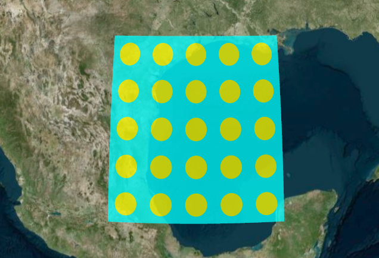
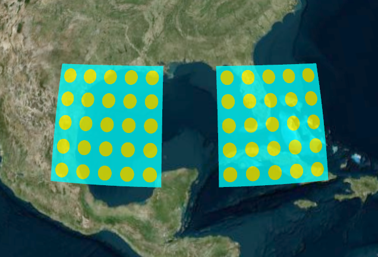
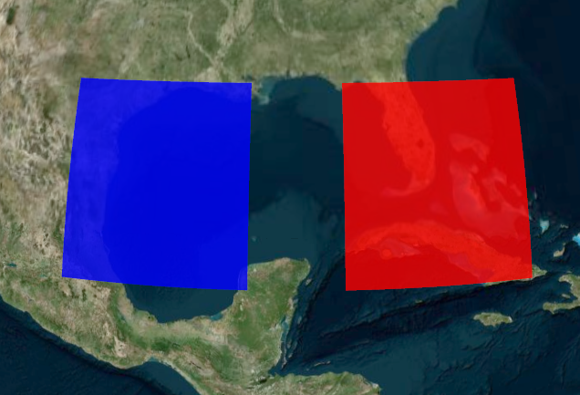
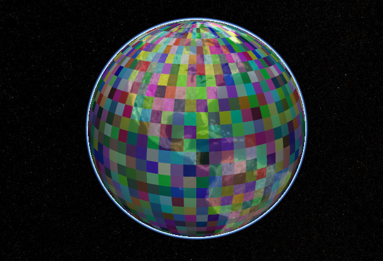
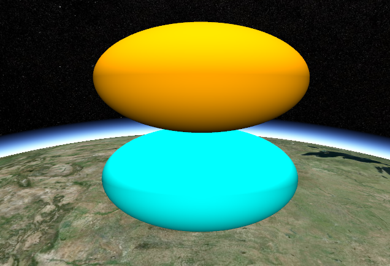
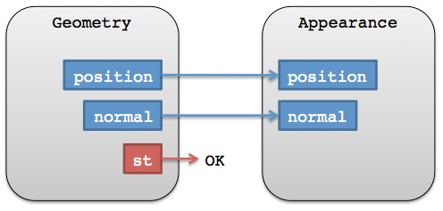
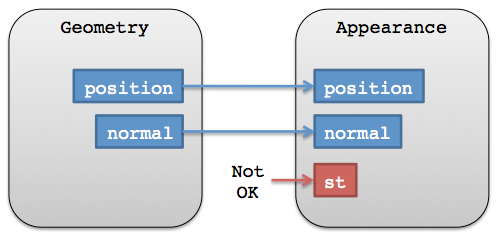
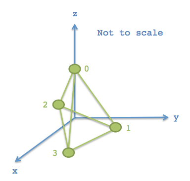
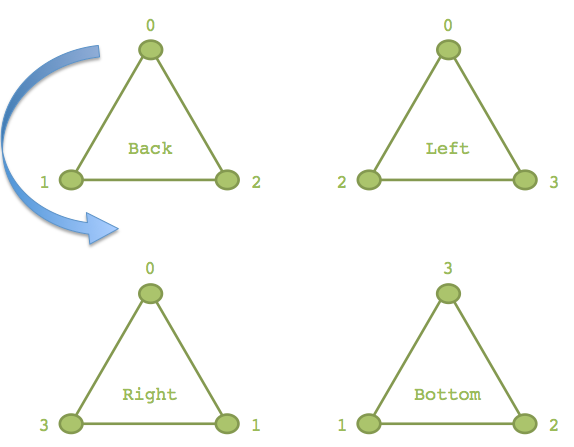

This is a draft for a three-part blog series.  The first two are Cesium tutorials.  The last is a general graphics tech article.

_Links to the reference doc don't work yet._

# Part I: Geometry and Appearances

Cesium has a library of primitives, like polygons and ellipsoids, that are the visual building blocks of our scene.  To use them, we create a primitive and give it position data and perhaps a [`material`](https://github.com/AnalyticalGraphicsInc/cesium/wiki/Fabric).  For example, the following creates a rectangle on the globe with a dot pattern:

```javascript
var extentPrimitive = new ExtentPrimitive({
  extent : Extent.fromDegrees(0.0, 20.0, 10.0, 30.0),
  material : Material.fromType(scene.getContext(), 'Dot')
});
scene.getPrimitives().add(extentPrimitive);
```

 

In this tutorial, we go under the hood of primitives and look at the [`Geometry`](http://cesium.agi.com/Cesium/Build/Documentation/Geometry.html) and [`Appearance`](http://cesium.agi.com/Cesium/Build/Documentation/Appearance.html) types that form them.  A geometry defines the primitive's structure, i.e., the triangles, lines, or points composing the primitive.  An appearance defines the primitive's shading, including its full GLSL vertex and fragment shaders, and render state.

Cesium supports the following geometries.

* [`PolygonGeometry`](http://cesium.agi.com/Cesium/Build/Documentation/PolygonGeometry.html) - A filled polygon on the globe or at a constant height above the globe.  The polygon can have holes and can be extruded to form a volume.
* [`ExtentGeometry`](http://cesium.agi.com/Cesium/Build/Documentation/ExtentGeometry.html) - A filled rectangular extent on the globe or at a constant height.  It can be rotated, and extruded to form a volume.
* [`EllipseGeometry`](http://cesium.agi.com/Cesium/Build/Documentation/EllipseGeometry.html) - A filled ellipse on the globe or at a constant height.  It can be rotated.
* [`CircleGeometry`](http://cesium.agi.com/Cesium/Build/Documentation/CircleGeometry.html) - A filled circle on the globe or at a constant height.
* [`WallGeometry`](http://cesium.agi.com/Cesium/Build/Documentation/WallGeometry.html) - A wall perpendicular to the globe.  It can be relative to terrain or a constant height.
* [`SimplePolylineGeometry`](http://cesium.agi.com/Cesium/Build/Documentation/SimplePolylineGeometry.html) - An arbitrary polyline.
* [`BoxGeometry`](http://cesium.agi.com/Cesium/Build/Documentation/BoxGeometry.html) - A box.  Not all sides need to be equal length.
* [`EllipsoidGeometry`](http://cesium.agi.com/Cesium/Build/Documentation/EllipsoidGeometry.html) -  An ellipsoid.

**TODO: screenshots for each**

**TODO: screenshot of Sandcastle demo showing all geometries/appearances**

The benefits of using geometries and appearances directly are:
* **Performance** - when drawing a large number of static primitives, e.g., polygons for all the zip codes in the United States, using geometries directly allows us to combine them into a single geometry to reduce CPU overhead and better utilize the GPU.  **TODO: performance numbers.**
* **Flexibility** - Primitives combine geometry and appearance.  By decoupling them, we can modify them independently.  We can add new geometries that are compatible with many different appearances and vice-versa.
* **Low-level access** - Appearances provide close-to-the-metal access to rendering without having to worry about all the details of using the [`Renderer`](https://github.com/AnalyticalGraphicsInc/cesium/wiki/Architecture#renderer) directly.  Appearances make it easy to:
   * Write full GLSL vertex and fragment shaders.
   * Use custom render state.

There are also some downsides:
   * Using geometries and appearances directly requires more code and a deeper understanding of graphics.  Primitives are at the level of abstraction appropriate for mapping apps; geometries and appearances have a level of abstraction closer to a traditional 3D engine.
   * Combing geometries is effective for static data, not necessarily for dynamic data.

Let's rewrite the initial code example using geometries and appearances:
```javascript
// Original code:
// var extentPrimitive = new ExtentPrimitive({
//   extent : Extent.fromDegrees(0.0, 20.0, 10.0, 30.0),
//   material : Material.fromType(scene.getContext(), 'Dot')
// });
// scene.getPrimitives().add(extentPrimitive);

var instance = new GeometryInstance({
  geometry : new ExtentGeometry({
    extent : Extent.fromDegrees(0.0, 20.0, 10.0, 30.0),
    vertexFormat : EllipsoidSurfaceAppearance.VERTEX_FORMAT
  })
});

var extentPrimitive = new Primitive({
  geometryInstances : instance,
  appearance : new EllipsoidSurfaceAppearance({
    material : Material.fromType(scene.getContext(), 'Dot')
  })
});

scene.getPrimitives().add(extentPrimitive);
```

Instead of using the explicit [`ExtentPrimitive`](http://cesium.agi.com/Cesium/Build/Documentation/ExtentPrimitive.html) type, we used the generic [`Primitive`](http://cesium.agi.com/Cesium/Build/Documentation/Primitive.html), which combined the geometry instance and appearance.  For now, we will not differentiate between a `Geometry` and a [`GeometryInstance`](http://cesium.agi.com/Cesium/Build/Documentation/GeometryInstance.html) other than an instance is a container for a geometry.

To create the geometry for the extent, i.e., the triangles covering the rectangular region and that fit the curvature of the globe, we create an [`ExtentGeometry`](http://cesium.agi.com/Cesium/Build/Documentation/ExtentGeometry.html).

 

Since we know it is on the surface, we use the [`EllipsoidSurfaceAppearance`](http://cesium.agi.com/Cesium/Build/Documentation/EllipsoidSurfaceAppearance.html), which is able to save memory and support all materials given that the geometry is on the surface - or at a constant height.

## Combing Geometries

We see a performance benefit when we use the same primitive to draw multiple static geometries.  For example, let's draw two rectangles.
```javascript
var instance = new GeometryInstance({
  geometry : new ExtentGeometry({
    extent : Extent.fromDegrees(0.0, 20.0, 10.0, 30.0),
    vertexFormat : EllipsoidSurfaceAppearance.VERTEX_FORMAT
  })
});

var anotherInstance = new GeometryInstance({
  geometry : new ExtentGeometry({
    extent : Extent.fromDegrees(0.0, 40.0, 10.0, 50.0),
    vertexFormat : EllipsoidSurfaceAppearance.VERTEX_FORMAT
  })
});

var extentPrimitive = new Primitive({
  geometryInstances : [instance, anotherInstance],
  appearance : new EllipsoidSurfaceAppearance({
    material : Material.fromType(scene.getContext(), 'Dot')
  })
});

scene.getPrimitives().add(extentPrimitive);
```

 

We created another instance with a different extent, and then provided both instances to the primitive.

This requires that both instances are drawn with the same appearance.  However, some appearances allow each instance to provide unique attributes.  In particular we can use [`PerInstanceColorAppearance`](http://cesium.agi.com/Cesium/Build/Documentation/PerInstanceColorAppearance.html), to shade each instance with a different solid color.
```javascript
var instance = new GeometryInstance({
  geometry : new ExtentGeometry({
    extent : Extent.fromDegrees(0.0, 20.0, 10.0, 30.0)
  }),
  color : new Color(1.0, 0.0, 0.0, 0.5)
});

var anotherInstance = new GeometryInstance({
  geometry : new ExtentGeometry({
    extent : Extent.fromDegrees(0.0, 40.0, 10.0, 50.0)
  }),
  color : new Color(0.0, 0.0, 1.0, 0.5)
});

var extentPrimitive = new Primitive({
  geometryInstances : [instance, anotherInstance],
  appearance : new PerInstanceColorAppearance()
});

scene.getPrimitives().add(extentPrimitive);
```

 

Above, each instance has a [`Color`](http://cesium.agi.com/Cesium/Build/Documentation/Color.html), and the primitive is now constructed with `PerInstanceColorAppearance`, which knows to use each instance's color for shading, instead of a material.

Combining geometries allows Cesium to efficiently draw A LOT of geometries.  The following example draws 64,800 uniquely colored rectangles.  It will take a second or two to optimize the geometry, then drawing is very fast.
```javascript
var instances = [];

for (var lon = -180; lon < 180; ++lon) {
  for (var lat = -90; lat < 90; ++lat) {
    instances.push(new GeometryInstance({
      geometry : new ExtentGeometry({
        extent : Extent.fromDegrees(lon, lat, lon + 1, lat + 1)
      }),
      color : new Color(Math.random(), Math.random(), Math.random(), 0.5)
    }));
  }
}

var extentPrimitive = new Primitive({
  geometryInstances : instances,
  appearance : new PerInstanceColorAppearance()
});

scene.getPrimitives().add(extentPrimitive);
```

 

## Picking

After instances are combined, they are still independently accessible.  In particular, we can assigned a `pickData` to an instance, and use it to determine if the instance is picked with [`Scene.pick`](http://cesium.agi.com/Cesium/Build/Documentation/Scene.html#pick).  `pickData` can be any JavaScript type: a string, a number, an object with its own properties.

The following example creates an instance with a `pickData`, and writes a message to the console when the mouse moves over it.

```javascript
var instance = new GeometryInstance({
  geometry : new ExtentGeometry({
    extent : Extent.fromDegrees(0.0, 20.0, 10.0, 30.0)
  }),
  color : new Color(1.0, 0.0, 0.0, 0.5),
  pickData : 'an id'
});

var extentPrimitive = new Primitive({
  geometryInstances : instance,
  appearance : new PerInstanceColorAppearance()
});

scene.getPrimitives().add(extentPrimitive);

var handler = new ScreenSpaceEventHandler(scene.getCanvas());
handler.setInputAction(function (movement) {
    if (scene.pick(movement.endPosition) === 'an id') {
      console.log('Mouse is over instance.');
    }
  }, ScreenSpaceEventType.MOUSE_MOVE);
```
Using `pickData`, instead of the reference to the instance itself, allows the primitive - and the application - to avoid keeping a reference to the full instance - including its reference to the geometry - in memory after the primitive is constructed.  Since a geometry can contain several big typed arrays, this allows us to save a significant amount of memory.

## Geometry Instances

Thus far, we have defined a geometry instance only as a container for a geometry.  In addition, since multiple instances can reference the same `Geometry` each with a different `modelMatrix`, instances are used to position, scale, and orientate the same geometry in different parts of the scene.  This allows us to only compute the geometry once, and reuse it many times.

 

The following example creates one [`EllipsoidGeometry`](http://cesium.agi.com/Cesium/Build/Documentation/EllipsoidGeometry.html) and two instances.  Each instance references the ellipsoid geometry, but place it using a different `modelMatrix` resulting in one ellipsoid being on top of the other.

```javascript
var geometry = new EllipsoidGeometry({
  ellipsoid : new Ellipsoid(500000.0, 500000.0, 250000.0)
});

var instance = new GeometryInstance({
  geometry : geometry,
  modelMatrix : Matrix4.multiplyByTranslation(Transforms.eastNorthUpToFixedFrame(
      ellipsoid.cartographicToCartesian(Cartographic.fromDegrees(0.0, 0.0))), new Cartesian3(0.0, 0.0, 250000.0)),
  color : Color.AQUAMARINE
});

var anotherInstance = new GeometryInstance({
  geometry : geometry,
  modelMatrix : Matrix4.multiplyByTranslation(Transforms.eastNorthUpToFixedFrame(
    ellipsoid.cartographicToCartesian(Cartographic.fromDegrees(0.0, 0.0))), new Cartesian3(0.0, 0.0, 750000.0)),
  color : Color.BLANCHEDALMOND
});

scene.getPrimitives().add(new Primitive({
  geometryInstances : [instance, anotherInstance],
  appearance : new PerInstanceColorAppearance({
    translucent : false
  })
}));
```

 

## Appearances

Geometry defines structure.  The other key property of a primitive, `appearance`, defines the primitive's shading, that is, how individual pixels are colored.  A primitive can have many geometry instances, but it can only have one appearance.  Depending on the type of appearance, an appearance will have a [material](https://github.com/AnalyticalGraphicsInc/cesium/wiki/Fabric) that defines the bulk of the shading.

 

Cesium has the following appearances.

* [`MaterialAppearance`](http://cesium.agi.com/Cesium/Build/Documentation/MaterialAppearance.html) - An appearance that works with all geometry types and supports materials to describe shading.
* [`EllipsoidSurfaceAppearance`](http://cesium.agi.com/Cesium/Build/Documentation/EllipsoidSurfaceAppearance.html) - A version of `MaterialAppearance` that assumes geometry is on the surface of the globe, e.g., like a polygon, or at a constant height above it, and uses this assumption to save memory by procedurally computing many vertex attributes.
* [`PerInstanceColorAppearance`](http://cesium.agi.com/Cesium/Build/Documentation/PerInstanceColorAppearance.html) - Uses per-instance color to shade each instance a potentially unique color.
* [`DebugAppearance`](http://cesium.agi.com/Cesium/Build/Documentation/DebugAppearance.html) - A debugging aid for visualizing geometry vertex attributes.

Appearances define the full GLSL vertex and fragment shaders that execute on the GPU when the primitive is drawn.  We rarely touch these unless we are writing a custom appearance.  Appearances also define the full [render state](http://cesium.agi.com/Cesium/Build/Documentation/RenderState.html), which controls the GPU's state when the primitive is drawn.  We can define the render state directly or use higher-level properties like [`closed`](http://cesium.agi.com/Cesium/Build/Documentation/MaterialAppearance.html#closed) and [`translucent`](http://cesium.agi.com/Cesium/Build/Documentation/MaterialAppearance.html#translucent), which the appearance will convert into render state.  For example:
```javascript
// Perhaps for an opaque box that the viewer will not enter.
//  - Backface culled and depth tested.  No blending.

var appearance  = new PerInstanceColorAppearance({
  translucent : false,
  closed : true
});

// This appearance is the same as above
var another  = new PerInstanceColorAppearance({
  renderState : {
    depthTest : {
      enabled : true
    },
    cull : {
      enabled : true,
      face : CullFace.BACK
    }
  }
});
```
Once an appearance is created, we can't changed its `renderState` property, but we can change its `material`.  Likewise, we can also change a primitive's `appearance` property.

Most appearances also have [`flat`](http://cesium.agi.com/Cesium/Build/Documentation/MaterialAppearance.html#flat) and [`faceForward`](http://cesium.agi.com/Cesium/Build/Documentation/MaterialAppearance.html#faceForward) properties, which indirectly control the GLSL shaders.

* `flat` - Flat shading.  Do not take lighting into account.
* `faceForward` - When lighting, flip the normal so it is always facing the viewer.  The avoids black areas on back-faces, e.g., the instead of a box.

**TODO: screenshots of flat and faceForward**

## Geometry and Appearance Compatibility

We've already seen that not all appearances work with all geometries.  For example, `EllipsoidSurfaceAppearance` is not appropriate for `WallGeometry` since a wall is perpendicular to the globe, not parallel.

Beyond semantics like this, for an appearance to be mechanically compatible with a geometry, they must have matching vertex formats, which means the geometry must have the data that the appearance expects as input.  A [`VertexFormat`](http://cesium.agi.com/Cesium/Build/Documentation/VertexFormat.html) can be provided when creating a geometry.

We can keep things simple, but inefficient and wasteful, by requesting a geometry compute all vertices, which will make the geometry compatible with all appearances (ignoring per-instance attributes; see below).
```javascript
var geometry = new ExtentGeometry({
  vertexFormat : VertexFormat.ALL
  // ...
});
```

 
<br />
 

If we are using `EllipsoidSurfaceAppearance`, for example, we can get away with just requesting positions.
```javascript
var geometry = new ExtentGeometry({
  vertexFormat : VertexFormat.POSITION_ONLY
  // ...
});
```

In general, how do we know what vertex format to use for a given appearance?  Most appearances have a [`vertexFormat`](http://cesium.agi.com/Cesium/Build/Documentation/MaterialAppearance.html#vertexFormat) property or even a [`VERTEX_FORMAT`](http://cesium.agi.com/Cesium/Build/Documentation/EllipsoidSurfaceAppearance.html#VERTEX_FORMAT) static constant.
```javascript
var geometry = new ExtentGeometry({
  vertexFormat : EllipsoidSurfaceAppearance.VERTEX_FORMAT
  // ...
});

var geometry2 = new ExtentGeometry({
  vertexFormat : PerInstanceColorAppearance.VERTEX_FORMAT
  // ...
});

var appearance = new MaterialAppearance(/* ... */);
var geometry3 = new ExtentGeometry({
  vertexFormat : appearance.vertexFormat
  // ...
});
```
Also, a geometry's `vertexFormat` determines if it can be combined with another geometry.  Two geometries do not have to be the same type; they just need matching vertex formats.
 
## TODO

TODO: updating per-instance show/color/attribute

## Resources

In the reference documentation, see:

* [All geometries](http://cesium.agi.com/Cesium/Build/Documentation/index.html?filter=Geometry)
* [All appearances](http://cesium.agi.com/Cesium/Build/Documentation/index.html?filter=Appearance)
* [`Primitive`](http://cesium.agi.com/Cesium/Build/Documentation/Primitive.html)
* [`GeometryInstance`](http://cesium.agi.com/Cesium/Build/Documentation/GeometryInstance.html)

For more on materials, see [Fabric](https://github.com/AnalyticalGraphicsInc/cesium/wiki/Fabric).

For future plans, see the [Geometry and Appearances Roadmap](https://github.com/AnalyticalGraphicsInc/cesium/issues/766).

If you have questions, post them to the [forum](http://cesium.agi.com/forum.html).

# Part II: Creating Custom Geometry and Appearances

Since geometries and appearances are decoupled, we can add new geometries that are compatible with many appearances and vice-versa.  Doing so requires some knowledge of computer graphics and geometry.  In this tutorial, we create a simple new `Geometry` and `Appearance`.  If you develop new geometries or appearances that would be useful to the Cesium community, please consider [contributing them](https://github.com/AnalyticalGraphicsInc/cesium/blob/master/CONTRIBUTING.md).

## Geometry

[`Geometry`](http://cesium.agi.com/Cesium/Build/Documentation/GeometryInstance.html) is a geometry representation that supports indexed or non-indexed triangles, lines, or points.  Let's start by making a simple geometry for a [tetrahedron](https://en.wikipedia.org/wiki/Tetrahedron), which is a solid composed of four equilateral triangles forming a pyramid.

```javascript
var TetrahedronGeometry = function() {
    var negativeRootTwoOverThree = -Math.sqrt(2.0) / 3.0;
    var negativeOneThird = -1.0 / 3.0;
    var rootSixOverThree = Math.sqrt(6.0) / 3.0;

    var positions = new Float64Array(4 * 3);

    positions[0] = 0.0;
    positions[1] = 0.0;
    positions[2] = 1.0;

    positions[3] = 0.0;
    positions[4] = (2.0 * Math.sqrt(2.0)) / 3.0;
    positions[5] = negativeOneThird;

    positions[6] = -rootSixOverThree;
    positions[7] = negativeRootTwoOverThree;
    positions[8] = negativeOneThird;

    positions[9] = rootSixOverThree;
    positions[10] = negativeRootTwoOverThree;
    positions[11] = negativeOneThird;

    var attributes = {
        position : new GeometryAttribute({
            componentDatatype : ComponentDatatype.DOUBLE,
            componentsPerAttribute : 3,
            values : positions
        })
    };

    // 4 triangles, each with 3 vertices
    var indices = new Uint16Array(4 * 3);

    indices[0] = 0;
    indices[1] = 1;
    indices[2] = 2;

    indices[3] = 0;
    indices[4] = 2;
    indices[5] = 3;

    indices[6] = 0;
    indices[7] = 3;
    indices[8] = 1;

    indices[9] = 3;
    indices[10] = 1;
    indices[11] = 2;

    this.attributes = attributes;
    this.indices = indices;
    this.primitiveType = PrimitiveType.TRIANGLES;
    this.boundingSphere = undefined;
};
```

**TODO screenshot**

The tetrahedron is made up of four vertices, whose positions lie on the unit sphere.  For precision, we always store positions in a `Float64Array`.

 

Each of the tetrahedron's four triangles is defined by three indices.  Using indices - as opposed to defining three vertices per triangle - allows us to reuse vertices to save memory.  For our tetrahedron, each vertex is indexed three times since each vertex has three incident triangles.  Indices are stored in a `Uint16Array`, but can also be stored in a `Uint32Array` if more than 64K vertices are used.

**Tip:** Use [`IndexDatatype.createTypedArray`](http://cesium.agi.com/Cesium/Build/Documentation/IndexDatatype.html#createTypedArray) to allocate the right typed array for indices.

 

As shown with the blue arrow on the back triangle, the outward-facing side of the triangle is defined by ordering indices in counter-clockwise order.  If we wrapped four fingers of our righthand around the back triangle in the orders the indices are defined, `0 - 1 - 2`, our thumb points in the direction that is considered outward facing.  In Cesium, this counter-clockwise winding order is required.

Our tetrahedron assigns to four public properties, which are required to meet the [`Geometry`](http://cesium.agi.com/Cesium/Build/Documentation/Geometry.html) interface.
```
this.attributes = attributes;
this.indices = indices;
this.primitiveType = PrimitiveType.TRIANGLES;
this.boundingSphere = undefined;
```
* [`attributes`](http://cesium.agi.com/Cesium/Build/Documentation/Geometry.html#attributes) - An object where each property is a [`GeometryAttribute`](http://cesium.agi.com/Cesium/Build/Documentation/GeometryAttribute.html), which defines one attribute and contains its data in a typed array.  Examples of attributes include positions, normals, and colors.  All attributes define the vertices of the geometry.
* [`indices`](http://cesium.agi.com/Cesium/Build/Documentation/Geometry.html#indices) - Optional index data that indexes into `attributes`.  Using indices allows us to reuse vertices without duplicating them and is virtually aways a win when geometry has shared vertices like our tetrahedron.
* [`primitiveType`](http://cesium.agi.com/Cesium/Build/Documentation/Geometry.html#primitiveType) - The primitive type that composes the geometry.  Most often this is [`TRIANGLES`](http://cesium.agi.com/Cesium/Build/Documentation/PrimitiveType.html#TRIANGLES) or [`LINES`](http://cesium.agi.com/Cesium/Build/Documentation/PrimitiveType.html#LINES), which provide the most flexibility.  For example, when `TRIANGLES` is used, every three indices (or vertices) is interpreted as a triangle.
* [`boundingSphere`](http://cesium.agi.com/Cesium/Build/Documentation/Geometry.html#boundingSphere) - An optional sphere that encloses the geometry.  This is used to improve drawing performance via culling.

### Bounding Spheres

We can improve the performance of drawing our tetrahedron by computing the bounding sphere.
```javascript
this.boundingSphere = BoundingSphere.fromVertices(positions);
```
[`BoundingSphere`](http://cesium.agi.com/Cesium/Build/Documentation/BoundingSphere.html) has functions to compute a tight bounding sphere like `fromVertices`, but in many cases we can use our knowledge of the geometry to quickly create a tighter bounding sphere.  Since we know the tetrahedron's vertices lie on the unit sphere, we can just use the unit sphere as the bounding sphere:
```javascript
this.boundingSphere = new BoundingSphere(new Cartesian3(0.0, 0.0, 0.0), 1.0);
```

### Visualizing the Tetrahedron with a Primitive

TODO

**TODO: tip for visualizing bounding spheres with command debugging**

**TODO: tip for visualizing vectors with [`createTangentSpaceDebugPrimitive`](http://cesium.agi.com/Cesium/Build/Documentation/createTangentSpaceDebugPrimitive.html)**

# Part III: Geometry Batching for Vector Data Rendering

**TODO**