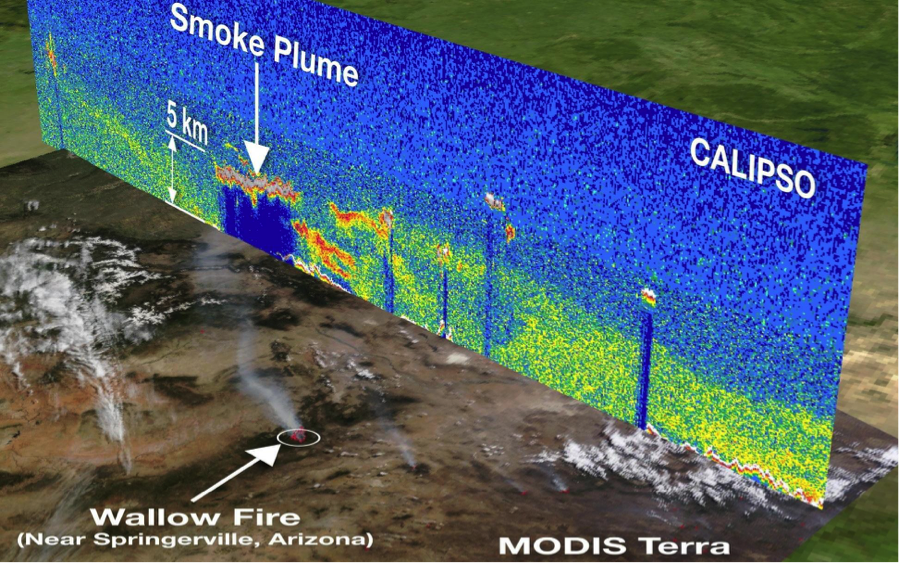
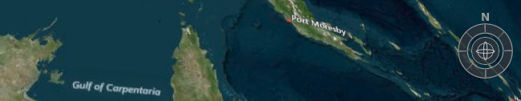
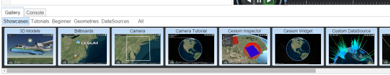
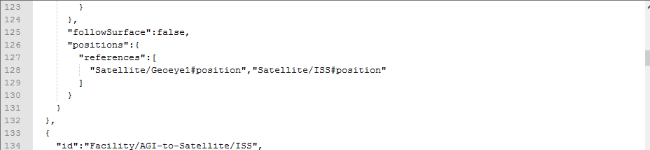
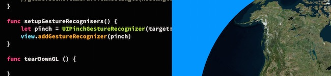

# Google Summer of Code 2015

_News: student applications are open until March 27, 2015. Please apply on the [GSoC website](http://www.google-melange.com/gsoc/org2/google/gsoc2015/cesium)._

[Cesium](http://cesiumjs.org/) is an open-source JavaScript library for creating 3D globes and 2D maps in a web browser without a plugin. It uses HTML5 and [WebGL](http://www.khronos.org/webgl) for hardware-accelerated graphics.  Our code has shipped to [10's of millions of people in the same day](http://cesiumjs.org/demos/noradtrackssanta.html) and is used all around the world in fields as diverse as GIS, aerospace, real estate, sports, and entertainment.  The Cesium community is growing rapidly; check out the activity on the [forum](http://cesiumjs.org/forum.html) and [@CesiumJS](https://twitter.com/cesiumjs).

We have a culture of writing clean, peer-reviewed, tested code.  Our developers are experts in their fields; they write books, create open standards, and present at international conferences.  We look forward to helping you grow your skills and write beautiful code that has wide impact.

## Advice for Student Applications

When we look at student applications, we look for students who love to dive deep into a problem, research it carefully, experiment with potential solutions, and then code, test, and document the best implementation.  We like to see passion, craftsmanship, and conscientiousness.

To get your GSoC application noticed, take an afternoon or a weekend and write a small demo using Cesium, post it to GitHub, and then include a link in your GSoC application.  Get up to speed by reading the Cesium [tutorials](http://cesiumjs.org/tutorials.html), then get inspired by the [code examples](http://cesiumjs.org/Cesium/Apps/Sandcastle/) and [demos](http://cesiumjs.org/demos.html).

If instead of writing a demo, you would rather make a contribution to Cesium itself to help your GSoC application stand out, see the [Cesium Contributor's Guide](https://github.com/AnalyticalGraphicsInc/cesium/wiki/Contributor%27s-Guide) and [list of beginner issues](https://github.com/AnalyticalGraphicsInc/cesium/issues?q=is%3Aopen+is%3Aissue+label%3Abeginner).  Pick something that interests you, comment on the issue to get advice, then send us a pull request when it is ready.  Note that we can't merge a pull request until you submit a signed [Contributor License Agreement](https://github.com/AnalyticalGraphicsInc/cesium/blob/master/CONTRIBUTING.md).

If you need help, post a question to the [Google Summer of Code 2015 thread](https://groups.google.com/forum/#!topic/cesium-dev/QnOxsA0iwa0) on the Cesium forum.  The core developers are active on the forum and will be happy to respond.

**Technologies and Tools We Use**

JavaScript, HTML, CSS, WebGL, GitHub, Eclipse, Chrome, Firefox, Android, iOS

(We don't expect you to know all of them).

# Project Idea List

* [NASA's Data Curtains from Space](#nasa)
* [Cesium demos pack](#demospack)
* [Compass / Navigation Widget](#navigation)
* [Refactor Cesium Sandcastle](#sandcastle)
* [CZML Export](#czml)
* [Cesium iOS port controls/UI](#ios)
* [Suggest your own idea](#suggest)
* [Liquid Galaxy Panoramic Display](#liquid)

<a name="nasa">
## NASA's Data Curtains from Space

While traditional satellite imagery neatly wraps around a globe, NASA's CloudSat and CALIPSO spacecraft take measurements which stand perpendicular to the Earth's surface to form "curtains".  They measure vertical profiles of the atmosphere such as clouds and dust to provide a perspective that "flat maps" simply cannot.

**Data Visualization**

As of now, most scientific visualizations of these profiles draw a line through the overhead view to show an orbit track and then draw the profile data separately.  [See here for an example](http://www-calipso.larc.nasa.gov/products/lidar/browse_images/show_date.php?s=production&v=V3-30&browse_date=2015-02-10).

There is, however, a great potential for combining the insights from both "profile" data and "flat" data into a single interface.   The image above and [this article](http://www.nasa.gov/mission_pages/calipso/mission/5years.html) show how the effects of a wildfire can be visualized by looking at both kinds of data.

While the above example was specially crafted by visualization experts, it would be valuable for any user to be able to instantly visualize these two types of imagery together.  The Cesium platform presents an ideal way to perform this task by being able to visualize both "flat" maps and arbitrary 3-D geometry on demand.

**Data Analysis**

While the first step of this task will be to visualize the profile data alongside traditional data, the next step is to develop tools to measure properties of the profile data such as the height.  [See here for a static example](http://www.nasa.gov/images/content/508982main_diabar-calipso-full.jpg).

**Data Management**

For the purposes of prototyping a solution, imagery of profile data can be loaded into Cesium in whatever manner is most convenient.  However, there needs to be a way for ALL of the profile imagery (i.e., 8+ years' worth) collected by these satellites to be served by NASA and accessed by clients such as Cesium.  While standards exist for serving and accessing flat maps, a new method may need to be devised for profile imagery.

**Where to Start**

Imagery of NASA's "flat maps" is readily served by the [Global Imagery Browse Services (GIBS)](https://wiki.earthdata.nasa.gov/display/GIBS/).  Examples of using GIBS with Cesium are [readily available on GitHub](https://github.com/nasa-gibs/gibs-web-examples).

Quick access to CALIPSO imagery can be downloaded [here](http://www-calipso.larc.nasa.gov/products/lidar/browse_images/show_calendar.php) while more detailed info can be found [here](https://www-calipso.larc.nasa.gov/search/login.php).  

**Skills:** JavaScript, data visualization, data management

**Level:** Intermediate to Advanced

**Mentor:** Mike McGann: mike.mcgann@nasa.gov

**Backup Mentor:** Ryan Boller: ryan.a.boller@nasa.gov

<a name="demospack">
## Cesium demos pack

Do you like to learn new APIs, write demos, and have your work in the spotlight?  In this project, we will write a series of demos that showcase Cesium with other popular JavaScript libraries.  Each demo will be pretty small, perhaps a few 100 to a 1,000 lines of code, and will serve both as a showcase and a reference implementation for developers to learn from.

Potential ideas include:

* Vector graphics - combine [Raphael](http://raphaeljs.com/) and Cesium to demonstrate adding SVG charts and graphs to Cesium.
* Geospatial analysis - demonstrate Cesium as a visualization platform for geospatial analysis (e.g., point in polygon, Triangulated Irregular Networks, etc.) using [Turf](http://turfjs.org/) either on the client or on the server using Node.js.
* Physics - Creating some cool effects by combining Cesium with a physics engine like [Oimo.js](https://github.com/lo-th/Oimo.js/), [cannon.js](http://schteppe.github.io/cannon.js/), or [ammo.js](https://github.com/kripken/ammo.js/).
* HTML5 - HTML5 has lots of interesting APIs that can be combined with Cesium.  What would you do with the video and camera APIs?  On mobile, how would you use the geolocation and accelerometer APIs?
* [AngularJS](https://angularjs.org/) - show how Cesium can be used with AngularJS.
* Like toying with hardware?  Why not write some JavaScript that runs Node.js on the [Tessel](https://tessel.io/) microcontroller to feed data from some of its add-on [modules](https://tessel.io/modules) (camera, climate, GPS, etc.) to Cesium for visualization?
* Data visualization - Combine [D3](http://d3js.org/) with Cesium for temporal geospatial data visualization like this [demo](http://cesiumjs.org/demos/d3.html).
* [WebSockets](http://www.html5rocks.com/en/tutorials/websockets/basics/) - Web sockets allow two-way client-server communication.  What would you build with them in Cesium?  Consider John Madden annotation synchronized between multiple Cesium clients!  Also consider using [PeerJS](http://peerjs.com/).
* [Three.js](http://threejs.org/) - demonstrate how Cesium can be combined with the Three.js WebGL library perhaps by syncing camera views between Cesium and Three.js canvases, overlaying a translucent Three.js canvas over Cesium, or embedding Three.js in Cesium's render loop.
* [WebCL](https://www.khronos.org/webcl/) - What would you do with hundreds of cores and the ability to launch thousands of threads?  WebCL exposes the GPU - and its massively parallel processors - to JavaScript (browser or with [Node.js](https://www.npmjs.com/package/node-webcl)).  How would combine this with Cesium?  
* Cesium on the server - Test out [node-webgl](https://www.npmjs.com/package/node-webgl).  Is it robust enough to run Cesium on the server?  Can we make it robust enough?  What would we do with it?  Perhaps server-side rendering of massive models or for clients without WebGL?
* Vector tiles - Use Cesium's [QuadtreePrimitive](https://github.com/AnalyticalGraphicsInc/cesium/blob/master/Source/Scene/QuadtreePrimitive.js) to render vector tiles, such as the ones from [MapBox](https://www.mapbox.com/blog/vector-tiles/).  What the are the limitations of 2D vector tiles in a 3D viewer like Cesium?  How could the vector tiling be improved?

_Tip_: if you are interested in this project, to best way to have a strong GSoC application is to code a quick demo ([start here](http://cesiumjs.org/2013/04/12/Cesium-up-and-running/)), post it on GitHub, and include a link in your GSoC application.

References
* Cesium [tutorials](http://cesiumjs.org/tutorials.html)
* Also check out the tutorials for the other libraries you plan to use.

**Skills:** JavaScript, HTML, CSS, UI/UX, git, Node.js, various front-end and back-end libraries

**Level:** Beginner / Intermediate

**Mentor:** Patrick Cozzi: [@pjcozzi](https://twitter.com/pjcozzi), pcozzi@agi.com

**Backup Mentor:** Matt Amato: [@matt_amato](https://twitter.com/matt_amato), matt.amato@gmail.com

<a name="navigation">
## Compass / Navigation Widget

Currently, Cesium allows users to rotate the camera around a point on the ground by middle-click dragging or by holding CTRL while left-click dragging.  It would be extremely helpful to expose this interaction in a more novice-friendly manner - as well as indicate which direction is North - with a navigation widget.

Students may optionally use the [navigation widget](https://github.com/NICTA/nationalmap/blob/master/src/ViewModels/NavigationViewModel.js) in the Cesium-based application [National Map](http://nationalmap.nicta.com.au) as a starting point and modify it to:

* fit nicely within the Cesium architecture
* work in 2D and Columbus View
* accommodate any other suggestions or requirements from the Cesium committers and community

References
* Camera [tutorial](http://cesiumjs.org/2013/02/13/Cesium-Camera-Tutorial/)
* Camera [reference documentation](http://cesiumjs.org/Cesium/Build/Documentation/Camera.html?classFilter=Camera)

**Skills:** JavaScript, HTML, CSS, UI/UX, git, Knockout, vectors, and matrices

**Level:** Intermediate

**Mentor:** [Kevin Ring](http://www.kotachrome.com/kevin): kevin@kotachrome.com

**Backup Mentor:** Dan Bagnell: dbagnell@agi.com

<a name="sandcastle">
## Refactor Cesium Sandcastle

Cesium Sandcastle is a great application for learning, demoing, and experimenting with Cesium. However, since it was one of the earliest Cesium applications written, it has a few drawbacks:

  * It lacks responsive design, making it useless on small tablets and mobile.
  * It looks like a traditional application instead of a modern web-app.
  * It depends on Dojo (and is the only thing in Cesium that does so).

This project would rewrite Sandcastle to address these issues.  Bootstrap will be used for responsive layout, data-binding should be introduced to the application via Knockout, and (since Bootstrap already depends on it), jQuery can be used sparingly in places where Dojo may have been using some heavy lifting.  The end result is a new Sandcastle which is easier to use, treats mobile as a first-class application, and brings more polish to our demo functionality.

If time allows, we would also like to enhance Sandcastle with some additional features:

  * The ability to load external examples, such as GitHub gists, or allow them to persist them via url.
  * The ability to export an example as a standalone application
  * The ability to persist examples on the server, perhaps anonymously, similar to jsFiddle or glslsandbox.  This would also include an extended gallery mode for browsing and finding demos and examples.

References
* [Cesium Sandcastle](http://cesiumjs.org/Cesium/Apps/Sandcastle/index.html)
* [Bootstrap](http://getbootstrap.com/)
* [Knockout](http://knockoutjs.com/)

**Skills:** JavaScript, HTML, CSS, UI/UX, Bootstrap, Knockout

**Level:** Intermediate

**Mentor:** Matt Amato: [@matt_amato](https://twitter.com/matt_amato), matt.amato@gmail.com

**Backup Mentor:** Ed Mackey: [@emackey](http://twitter.com/emackey)

<a name="czml">
## Add ability to export CZML from the Entity API

CZML is a JSON schema for data-driven visualization that is tied closely to Cesium capabilities.  CZML is to Cesium as KML is to Google Earth.  While Cesium's Entity API makes it easy to programmatically create and drive visualization.  When CZML is loaded, it gets turned into a collection of Entity objects.  This project would do the reverse, given a collection of Entity instances in Cesium, write out the corresponding CZML.  This has a variety of use cases, simple serialization and debugging being the primary once.  Eventually would would allow you to even generate CZML on the fly from JavaScript servers like node.

Since the project is pure JavaScript, students interested in applying should be able to show that they have good knowledge of it through either reference to code they've written or by fixing some beginner issues in Cesium.

References
* [CZML spec](http://git.io/czml)
* [Visualizing Spatial Data](http://cesiumjs.org/2015/02/02/Visualizing-Spatial-Data/)

**Skills:** JavaScript

**Level:** Intermediate

**Mentor:** Matt Amato: [@matt_amato](https://twitter.com/matt_amato), matt.amato@gmail.com

**Backup Mentor:** Ed Mackey: [@emackey](http://twitter.com/emackey)

<a name="ios">
## Cesium iOS port controls/UI

An iOS port of Cesium has been started, and currently the core geographic/math functions, renderer and textured globe support are working. Full visualisation support including CZML and KML support is planned, however before this happens a robust set of touch-based controls and user interface is required.

### Touch Controls

This could be as simple as translating the existing JavaScript code to Swift on top of and in the style of the existing renderer. However there is an opportunity here to completely reimagine the user experience with a virtual globe and create an impressive and intuitive interface.

### User Interface

The port also needs a robust touch interface for selecting terrain and imagery layers, adjusting rendering parameters and for navigation and search widgets. The best approach for this would be to implement a flexible GL-based UI toolkit in the vein of [Project WindStorm](http://zephyrosanemos.com/#heading1). Text rendering, on-screen keyboard support and dialog boxes would be good as a first step.

### Where To Start

The port uses OpenGL ES 3.0 and Swift 1.2 so some experience in at least one or both of these technologies is preferred, although extensive familiarity is not essential as the existing renderer provides significant abstraction above OpenGL.

A good application for this would include a description of your iOS and programming background. An example port of an existing JavaScript Cesium class to Swift in your application would help it stand out. It is required that you have an Apple iOS developer membership or obtain one if accepted as on-device testing will be essential.

### References

The existing codebase is available at [GitHub](https://github.com/tokyovigilante/CesiumKit/tree/master).

**Skills:** OpenGL ES, iOS development with Swift, UI/UX design

**Level:** Intermediate

**Mentor:** [Ryan Walklin](mailto:ryan@testtoast.com)

**Backup Mentor:** TBA

<a name="suggest">
## Suggest your own idea

We're excited to hear your ideas for projects that would benefit the Cesium community.  Perhaps you're interested in WebGL and JavaScript optimization, and want to improve the core engine?  Perhaps you are passionate about geospatial data formats and want to write new loaders for Cesium?  Or perhaps you are excited about [WebVR](http://mozvr.com/posts/webvr-lands-in-nightly/) and want to create the ultimate virtual reality app with Cesium?

Whatever it is, we want to hear about it!  Pitch your idea and find a mentor by posting a short description to the [Google Summer of Code 2015 thread](https://groups.google.com/forum/#!topic/cesium-dev/QnOxsA0iwa0) on the Cesium forum.

_Tip_: the best way to get a potential mentor's attention is to code a quick prototype ([start here](http://cesiumjs.org/2013/04/12/Cesium-up-and-running/)), post it on GitHub, and include a link when you post to the [Google Summer of Code 2015 thread](https://groups.google.com/forum/#!topic/cesium-dev/QnOxsA0iwa0).

References
* To get inspired, check out the Cesium [tutorials](http://cesiumjs.org/tutorials.html), [code examples](http://cesiumjs.org/Cesium/Apps/Sandcastle/), [demos](http://cesiumjs.org/demos.html), [roadmap](https://github.com/AnalyticalGraphicsInc/cesium/wiki/Roadmap), and [beginner issues](https://github.com/AnalyticalGraphicsInc/cesium/labels/beginner).

**Skills:** Depends on the project

**Level:** Beginner to Advanced

**Mentor:** Find one on the Cesium forum by posting to the [Google Summer of Code 2015 thread](https://groups.google.com/forum/#!topic/cesium-dev/QnOxsA0iwa0)

**Backup Mentor:** See above

<a name="liquid">
## Liquid Galaxy Panoramic Display

Liquid Galaxy is an awesome panoramic display system.  They are also a mentoring organization in Google Summer of Code, and want to run Cesium on their display.  This will be a compelling high-visibility project.  **If you are interested, please [apply to their organization](https://code.google.com/p/liquid-galaxy/wiki/GSoC2015Ideas)**.