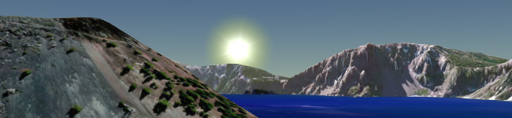

# Google Summer of Code 2015

[Cesium](http://cesiumjs.org/) is an open-source JavaScript library for creating 3D globes and 2D maps in a web browser without a plugin. It uses HTML5 and [WebGL](http://www.khronos.org/webgl) for hardware-accelerated graphics.  Our code has shipped to [10's of millions of people in the same day](http://cesiumjs.org/demos/noradtrackssanta.html) and is used all around the world in fields as diverse as GIS, aerospace, real estate, sports, and entertainment.  The Cesium community is growing rapidly; check out the activity on the [forum](http://cesiumjs.org/forum.html) and [@CesiumJS](https://twitter.com/cesiumjs).

We have a culture of writing clean, peer-reviewed, tested code.  Our developers are experts in their fields; they write books, create open standards, and present at international conferences.  We look forward to helping you grow your skills and write beautiful code that has wide impact.

## Advice for Student Applications

When we look at student applications, we look for students who love to dive deep into a problem, research it carefully, experiment with potential solutions, and then code, test, and document the best implementation.  We like to see passionate, craftsmanship, and conscientiousness.

To get your GSoC application noticed, take an afternoon or a weekend and write a small demo using Cesium, post it to GitHub, and then include a link in your GSoC application.  Get up to speed by reading the Cesium [tutorials](http://cesiumjs.org/tutorials.html), then get inspired by the [code examples](http://cesiumjs.org/Cesium/Apps/Sandcastle/) and [demos](http://cesiumjs.org/demos.html).

If instead of writing a demo, you would rather make a contribution to Cesium itself to help your GSoC application stand out, see the [Cesium Contributor's Guide](https://github.com/AnalyticalGraphicsInc/cesium/wiki/Contributor%27s-Guide) and [list of beginner issues](https://github.com/AnalyticalGraphicsInc/cesium/issues?q=is%3Aopen+is%3Aissue+label%3Abeginner).  Pick something that interests you, comment on the issue to get advice, then send us a pull request when it is ready.  Note that we can't merge a pull request until you submit a signed [Contributor License Agreement](https://github.com/AnalyticalGraphicsInc/cesium/blob/master/CONTRIBUTING.md).

If you need help, post a question to the [Google Summer of Code 2015 thread](https://groups.google.com/forum/#!topic/cesium-dev/QnOxsA0iwa0) on the Cesium forum.  The core developers are active on the forum and will be happy to respond.

**Technologies and Tools We Use**

JavaScript, HTML, CSS, WebGL, GitHub, Eclipse, Chrome, Firefox, Android, iOS

(We don't expect you to know all of them).

# Project Idea List

* [Cesium demos pack](#demospack)
* [Suggest your own idea](#suggest)

<a name="demospack">
## Cesium demos pack

Do you like to learn new APIs, write demos, and have your work in the spotlight?  In this project, we will write a series of demos that showcase Cesium with other popular JavaScript libraries.  Each demo will be pretty small, perhaps a few 100 to a 1,000 lines of code, and will serve both as a showcase and a reference implementation for developers to learn from.

Potential ideas include:

* Vector graphics - combine [Raphael](http://raphaeljs.com/) and Cesium to demonstrate adding SVG charts and graphs to Cesium.
* Geospatial analysis - demonstrate Cesium as a visualization platform for geospatial analysis (e.g., point in polygon, Triangulated Irregular Networks, etc.) using [Turf](http://turfjs.org/) either on the client or on the server using Node.js.
* Physics - Creating some cool effects by combining Cesium with a physics engine like [Oimo.js](https://github.com/lo-th/Oimo.js/), [cannon.js](http://schteppe.github.io/cannon.js/), or [ammo.js](https://github.com/kripken/ammo.js/).
* HTML5 - HTML5 has lots of interesting APIs that can be combined with Cesium.  What would you do with the video and camera APIs?  On mobile, how would you use the geolocation and accelerometer APIs?
* [AngularJS](https://angularjs.org/) - show how Cesium can be used with AngularJS.
* [Three.js](http://threejs.org/) - demonstrate how Cesium can be combined with the Three.js WebGL library perhaps by syncing camera views between Cesium and Three.js canvases, overlaying a translucent Three.js canvas over Cesium, or embedding Three.js in Cesium's render loop.
* Like toying with hardware?  Why not write some JavaScript that runs Node.js on the [Tessel](https://tessel.io/) microcontroller to feed data from some of its add-on [modules](https://tessel.io/modules) (camera, climate, GPS, etc.) to Cesium for visualization?
* Data visualization - Combine [D3](http://d3js.org/) with Cesium for temporal geospatial data visualization like this [demo](http://cesiumjs.org/demos/d3.html).

_Tip_: if you are interested in this project, to best way to have a strong GSoC application is to code a quick demo ([start here](http://cesiumjs.org/2013/04/12/Cesium-up-and-running/)), post it on GitHub, and include a link in your GSoC application.

References
* Cesium [tutorials](http://cesiumjs.org/tutorials.html)
* Also check out the tutorials for the other libraries you plan to use.

**Skills:** JavaScript, HTML, CSS, UI/UX, git, Node.js, various front-end and back-end libraries

**Level:** Beginner / Intermediate

**Mentor:** Patrick Cozzi: [@pjcozzi](https://twitter.com/pjcozzi), pcozzi@agi.com

**Backup Mentor:** Matt Amato: [@matt_amato](https://twitter.com/matt_amato), mamato@agi.com

<a name="suggest">
## Suggest your own idea

We're excited to hear your ideas for projects that would benefit the Cesium community.  Perhaps you're interested in WebGL and JavaScript optimization, and want to improve the core engine?  Perhaps you are passionate about geospatial data formats and want to write new loaders for Cesium?  Or perhaps you are excited about [WebVR](http://mozvr.com/posts/webvr-lands-in-nightly/) and want to create the ultimate virtual reality app with Cesium?

Whatever it is, we want to hear about it!  Pitch your idea and find a mentor by posting a short description to the [Google Summer of Code 2015 thread](https://groups.google.com/forum/#!topic/cesium-dev/QnOxsA0iwa0) on the Cesium forum.

_Tip_: the best way to get a potential mentor's attention is to code a quick prototype ([start here](http://cesiumjs.org/2013/04/12/Cesium-up-and-running/)), post it on GitHub, and include a link when you post to the [Google Summer of Code 2015 thread](https://groups.google.com/forum/#!topic/cesium-dev/QnOxsA0iwa0).

References
* To get inspired, check out the Cesium [tutorials](http://cesiumjs.org/tutorials.html), [code examples](http://cesiumjs.org/Cesium/Apps/Sandcastle/), [demos](http://cesiumjs.org/demos.html), [roadmap](https://github.com/AnalyticalGraphicsInc/cesium/wiki/Roadmap), and [beginner issues](https://github.com/AnalyticalGraphicsInc/cesium/labels/beginner).

**Skills:** Depends on the project

**Level:** Beginner to Advanced

**Mentor:** Find one on the Cesium forum by posting to the [Google Summer of Code 2015 thread](https://groups.google.com/forum/#!topic/cesium-dev/QnOxsA0iwa0)

**Backup Mentor:** See above