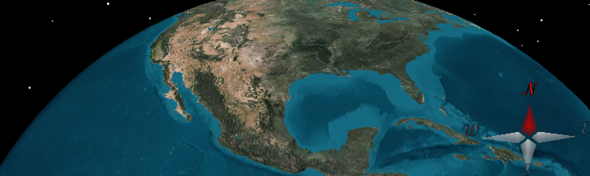
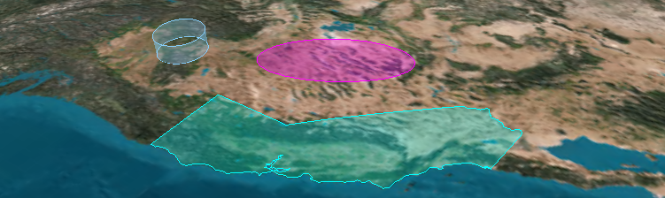
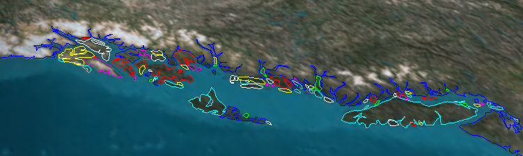
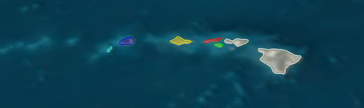
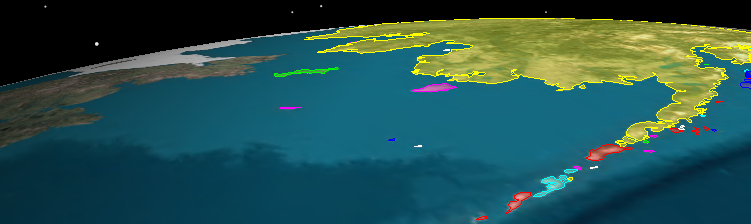
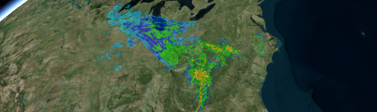
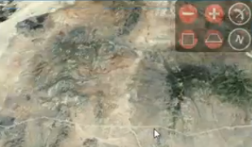
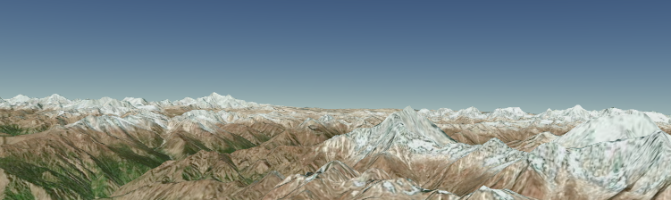

# Google Summer of Code 2013 Idea List

[Cesium](http://cesium.agi.com/) is an open-source JavaScript library for creating 3D globes and 2D maps in a web browser without a plugin. It uses HTML5 and [WebGL](http://www.khronos.org/webgl) for hardware-accelerated graphics.

**Information for Students**

Cesium developers are eager to work with you.  Our code has shipped to [10's of millions of people in the same day](http://cesium.agi.com/noradtrackssanta2012.html).  We have a culture of writing clean, peer-reviewed, tested code.  We look forward to helping you grow your skills and ship beautiful code that has wide impact.

If you have questions about your proposal, email the project's mentor or discuss it on our [mailing list](https://groups.google.com/forum/#!forum/cesium-dev).  We encourage innovation; we are open to proposals for original projects not listed here.  See our [roadmap](https://github.com/AnalyticalGraphicsInc/cesium/wiki/Roadmap) for ideas.

_Tip:_ Strengthen your proposal by reading our [Contributor's Guide](https://github.com/AnalyticalGraphicsInc/cesium/wiki/Contributor%27s-Guide) and showing that you were able to get Cesium running locally on your machine.  It's easy.  If you need help, [just ask](https://groups.google.com/forum/#!forum/cesium-dev).

Project Ideas
* [Android](#android)
   * [Android Performance](#androidperformance)
* [Graphics](#graphics)
   * [Compass](#compass)
   * [Declutter for Map Labels](#decultterformaplabels)
   * [Geometric Algorithms](#geometricalgorithms)
* [Geospatial](#geospatial)
   * [Vector Data Visualization with JSON](#json)
   * [Vector Data Visualization with Geography Markup Language](#gml)
   * [Vector Data Visualization with Web Feature Service](#wfs)
   * [Raster Data Visualization with Web Map Tile Service](#wmts)
* [UI](#ui)
   * [Navigation Widget](#navigationwidget)
* [Misc](#misc)
   * [Offline Web App Support](#offlinewebappsupport)

<a name="android">
# Android

<a name="androidperformance">
## Android Performance

WebGL support is improving rapidly on Android.  Chrome and Firefox are capable of running Cesium on several phones and tablets.  However, these devices do not have the same CPU and GPU performance as a desktop.  On many devices, Cesium runs well, but that's not enough for us - we want it to scream.

Help us optimize Cesium for these devices.  We will profile to find hot-spots and then tune the GPU code written in GLSL or the CPU code written in JavaScript or both.  We'll consider fundamental architecture changes as needed and will carefully make visual quality vs. speed trade-offs.

Since this is the bleeding edge, we expect to find bugs in the browsers and GPU drivers.  We'll work with browser and GPU vendors to resolve these and make the mobile platform better for everyone.

References
* [Cesium Mobile Compatibility](https://github.com/AnalyticalGraphicsInc/cesium/wiki/Mobile-Details)
* [Fast Mobile Shaders](http://aras-p.info/texts/files/FastMobileShaders_siggraph2011.pdf)

**Skills:** WebGL, JavaScript, Android, profiling, optimizing JavaScript and GLSL, git

**Level:** Advanced

**Mentor:** Kevin?

**Backup Mentor:** Cozzi?

<a name="graphics">
# Graphics

<a name="compass">
## Compass

In this project, we'll add a 3D compass showing where north is, as shown in the bottom-right of the above screenshot.  We'll consider the trade-offs between creating the compass as a separate widget with SVG and CSS 3D transforms vs. creating the compass as part of Cesium using WebGL.  The compass is particularly useful for views close to ground so the user understands the orientation of the view.

This project requires design and coding skills, and a tad of math that we'll help with.

**Skills:** JavaScript, CSS, SVG, WebGL, git

**Level:** Intermediate

**Mentor:** Ed?

**Backup Mentor:** Dan?

<a name="decultterformaplabels">
## Declutter for Map Labels

A classic problem when drawing 2D or 3D maps is the overlap of nearby text labels, resulting in a cluttered display and illegible labels.  We will design and implement an efficient real-time algorithm to declutter map labels, avoiding or minimizing overlap.

This is an NP-hard problem, and therefore we will solve it heuristically in an attempt to minimize the amount we move each label and maintain temporal aesthetics.  We will also explore creating hierarchies of labels using [k-means](http://home.dei.polimi.it/matteucc/Clustering/tutorial_html/kmeans.html) and/or knowledge of hierarchical label relationships, e.g., street - city - county - state.

The algorithm needs to be very efficient; it must run in JavaScript and work for 100s of dynamic labels or 1000s of static labels.

References
* [Temporally Coherent Real-Time Labeling of Dynamic Scenes](http://wwwcg.in.tum.de/research/research/publications/2012/temporally-coherent-real-time-labeling-of-dynamic-scenes.html)
* [K-Means Clustering](http://home.dei.polimi.it/matteucc/Clustering/tutorial_html/kmeans.html)

**Skills:** Algorithm design, strong math, code and algorithm optimization, JavaScript, git

**Level:** Advanced

**Mentor:** [Patrick Cozzi](http://www.seas.upenn.edu/~pcozzi/) - pjcozzi@siggraph.org

**Backup Mentor:** Dan?

<a name="geometricalgorithms">
## Geometric Algorithms

We use geometric algorithms to compute triangles composing shapes on the globe such as circles, ellipsoids, polygons, etc.  We then use the triangles to draw the shape using WebGL.

In this project, we will add geometric algorithms for new shapes and optimize existing geometric algorithms.  We will:
   * Add triangulation for walls perpendicular to the globe.  This includes computing positions, averaged normals, and texture coordinates.
   * Optimize polygon ear clipping and improve its robustness at the International Date Line.
   * Optimize triangulation for circles and ellipses.

We'll consider other shapes as time permits.

References
* [Triangulation by Ear Clipping](http://www.geometrictools.com/Documentation/TriangulationByEarClipping.pdf)

**Skills:** Strong geometry and math skills, data structures and algorithms, optimization, JavaScript, git

**Level:** Intermediate

**Mentor:** Dan?

**Backup Mentor:** Cozzi?

<a name="geospatial">
# Geospatial

<a name="json">
## Vector Data Visualization with JSON

KML is a popular XML-based format for storing vector data, i.e., points, polylines, and polygons.  However, new JSON-based standards are emerging that are better suited to web mapping.

In this project, we will add support for two JSON vector data formats, [GeoJSON](http://www.geojson.org/) and [TopoJSON](https://github.com/mbostock/topojson), to Cesium.  First, we'll load and draw them using the Cesium API.  Then we'll investigating styling with colors, patterns, etc.

References
* [The GeoJSON Format Specification](http://www.geojson.org/geojson-spec.html)
* [TopoJSON Specification](https://github.com/mbostock/topojson/wiki/Specification)

**Skills:** JavaScript, git, open standards, geospatial

**Level:** Novice

**Mentor:** Amato?

**Backup Mentor:** Ford?

<a name="gml">
## Vector Data Visualization with Geography Markup Language

[Geography Markup Language (GML)](http://www.opengeospatial.org/standards/gml) is an [Open Geospatial Consortium (OGC)](http://www.opengeospatial.org/) standard for expressing geographical features, e.g., points, polylines, and polygons, in XML.

In this project, we will add support to Cesium to draw and style features from GML.  The GML spec is quite large with many different feature types.  We can limit our scope to the OpenGIS GML Simple Features Profile, which defines a common subset.

This project is a stepping stone to supporting [Web Feature Service (WFS)](http://www.opengeospatial.org/standards/wfs) below.

References
* [Geography Markup Language (GML)](http://www.opengeospatial.org/standards/gml)

**Skills:** C#, JavaScript, XML, git, open standards, geospatial

**Level:** Intermediate

**Mentor:** TBA

**Backup Mentor:** TBA

<a name="wfs">
## Vector Data Visualization with Web Feature Service

[Web Feature Service (WFS)](http://www.opengeospatial.org/standards/wfs) is an [Open Geospatial Consortium (OGC)](http://www.opengeospatial.org/) standard for requesting geographical features, e.g., points, polylines, and polygons, over the web.

In this project, we will add support to Cesium to request geographical features using WFS over HTTP, and draw and style them.  Time permitting, we will also implement client-side creation, deletion, and modification of features and the resulting server updates using WFS-T (Transactional).

This project depends on the [Geography Markup Language (GML)](http://www.opengeospatial.org/standards/gml) project above since WFS features are returned using GML (based on XML).  GML support can be considered a subset of this project or a separate project.

References
* [Web Feature Service](http://www.opengeospatial.org/standards/wfs)

**Skills:** JavaScript, web services, XML, git, open standards, geospatial

**Level:** Intermediate

**Mentor:** TBA

**Backup Mentor:** TBA

<a name="wmts">
## Raster Data Visualization with Web Map Tile Service

Cesium draws 3D maps retrieved using many map standards like [Web Map Service (WMS)](http://www.opengeospatial.org/standards/wms) and [OpenStreetMap](http://wiki.openstreetmap.org/wiki/Main_Page).  These standards provide access to high-resolution maps.

In this project, we will add support for [Web Map Tile Service (WMTS)](http://www.opengeospatial.org/standards/wmts), an [Open Geospatial Consortium (OGC)](http://www.opengeospatial.org/) standard.

_TODO: more details_

References
* [Web Map Tile Service (WMTS)](http://www.opengeospatial.org/standards/wmts)
* [Cesium Imagery Layers Tutorial](http://cesium.agi.com/2013/01/04/Cesium-Imagery-Layers-Tutorial/)

**Skills:** JavaScript, REST APIs, git, open standards, geospatial

**Level:** Intermediate

**Mentor:** Fili?

**Backup Mentor:** Kevin?

<a name="ui">
# UI

<a name="navigationwidget">
## Navigation Widget

Cesium provides default mouse and touch input for the camera, including:
* Left click and drag - Rotates the camera around the globe in 3D and translates the camera over the map surface in 2D and Columbus view.
* Right click and drag - Zooms the camera in and out.
* Middle wheel scrolling - Also zooms the camera in and out.
* Middle click and drag - Rotates the camera around the point on the surface of the globe.

In this project, we'll create a modern widget, potentially using SVG, to allow the user to perform these camera actions with just the left mouse button or single click.  This project requires an eye for designing UIs.  More ideas for this project [here](https://github.com/AnalyticalGraphicsInc/cesium/issues/450).

References
* [Cesium Camera Tutorial](http://cesium.agi.com/2013/02/13/Cesium-Camera-Tutorial/)

**Skills:** HTML5, CSS3, SVG, JavaScript, UI design, git

**Level:** Intermediate

**Mentor:** Ed?

**Backup Mentor:** Amato?

<a name="misc">
# Misc

<a name="offlinewebappsupport">
## Offline Web App Support

Cesium provides a relastic virtual globe by streaming high-resolution terrain and imagery on-demand.  However, users without a network connection or an unreliable network connection cannot rely on the connection to servers hosting terrain, imagery, and other data used by Cesium.

In this project, we'll use new HTML5 features to design and implement offline support in Cesium.  That is, we'll let users select and download data for an area of the globe (pending the data provider's terms of use) so that users can use Cesium later without connectivity.

References
* [HTML5 Features - Offline](http://www.html5rocks.com/en/features/offline)
* [HTML5 Features - Storage](http://www.html5rocks.com/en/features/storage)
* [Dive Into HTML5: Let's Take This Offline](http://diveintohtml5.info/offline.html)

**Skills:** JavaScript, HTML5, git

**Level:** Novice

**Mentor:** Scott?

**Backup Mentor:** Kevin?