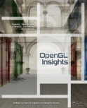
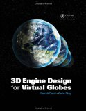

# Presentations and Publications

We enjoy giving talks and writing publications on Cesium and the technology we use to build it.  Doing so keeps us sharp, and we value giving back to the larger developer community.

## 2012

* Cesium Language (CZML): A JSON schema for describing dynamic scenes in virtual globes & maps.  Matt Amato.  [WebGL Camp Europe](http://www.shader.org/webglcamp/), 07/2012. [[slides](https://github.com/AnalyticalGraphicsInc/cesium/wiki/presentations/CZML_WebGL_Camp_07-03-2012.pdf) | [demos](http://cesium.agi.com/)]

* WebGL for Dynamic Virtual Globes.  Patrick Cozzi.  [WebGL Camp Orlando](http://www.webglcamp.com/wiki/index.php?title=AgendaOrlando1), 03/2012. [[slides](http://www.seas.upenn.edu/~pcozzi/downloads/WebGLForDynamicVirtualGlobes.pdf) | [video](http://www.youtube.com/watch?v=Bxk-bkiLbEo) | [demos](http://cesium.agi.com/)]

## 2011

* [3D Engine Design for Virtual Globes](http://www.virtualglobebook.com/).  Patrick Cozzi and Kevin Ring.  CRC Press, 06/2011.
 * Not strictly about Cesium, but about virtual globes in general.  Written by two Cesium contributors.  Some code from this book's engine, [OpenGlobe](https://github.com/virtualglobebook/OpenGlobe), was ported to Cesium.

<!--

-->