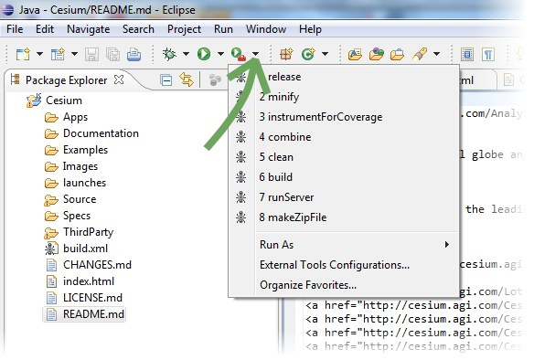

Getting started with a local copy of Cesium on Windows, Linux, and Mac is quick.

## Get the Code

* `git clone git@github.com:AnalyticalGraphicsInc/cesium.git`
   * Or download the latest [zip](https://github.com/AnalyticalGraphicsInc/cesium/downloads).

## Build

* Cesium uses [Ant](http://ant.apache.org/) for builds.  Ant is included in the Cesium repo, but it requires that the [Java](http://www.java.com/en/download/index.jsp) JDK be installed.
* From the root Cesium directory, run `./Tools/apache-ant-1.8.2/bin/ant combine`
   * On Windows: `.\Tools\apache-ant-1.8.2\bin\ant combine`

## Run

* Run `./Tools/apache-ant-1.8.2/bin/ant runServer` to start a web server, and browse to [[http://localhost:8080/]].
   * On Windows, `.\Tools\apache-ant-1.8.2\bin\ant runServer`

## Building and Running with Eclipse

If you have [Eclipse](http://www.eclipse.org/downloads/) you can run the above build from the GUI, and see output in the Eclipse console window.  The run menu looks like this:

## What Next?

Start hacking the examples, or read some more: the ten-minute [architecture overview](https://github.com/AnalyticalGraphicsInc/cesium/wiki/Architecture); the [contributor's guide](https://github.com/AnalyticalGraphicsInc/cesium/wiki/Contributor%27s-Guide) with more details on building and running; or the [reference documentation](http://cesium.agi.com/Documentation/).